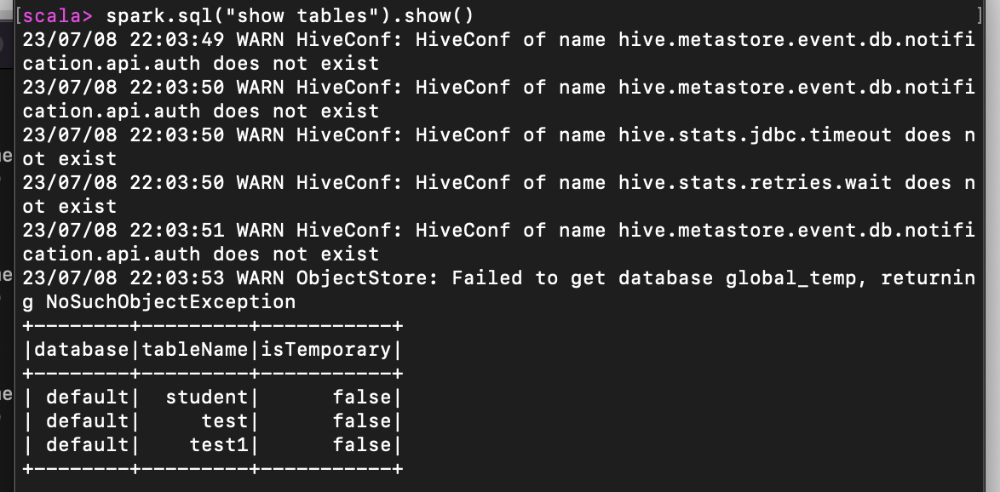

### Spark-shell

如果想连接外部已经部署好的 Hive，需要通过以下几个步骤： 

* Spark 要接管 Hive 需要把 hive-site.xml 拷贝到 conf/目录下 
*  把 Mysql 的驱动 copy 到 jars/目录下 
*  如果访问不到 hdfs，则需要把 core-site.xml 和 hdfs-site.xml 拷贝到 conf/目录下 
*  重启 spark-shell




### IDEA

* 导入依赖

  ```xml
  <dependency>
   <groupId>org.apache.spark</groupId>
   <artifactId>spark-hive_2.12</artifactId>
   <version>3.0.0</version>
  </dependency>
  <dependency>
   <groupId>org.apache.hive</groupId>
   <artifactId>hive-exec</artifactId>
   <version>1.2.1</version>
  </dependency>
  <dependency>
   <groupId>mysql</groupId>
   <artifactId>mysql-connector-java</artifactId>
   <version>5.1.27</version>
  </dependency>
  ```

* 将 hive-site.xml 文件拷贝到项目的 resources 目录中

* 代码

  ```scala
  def main(args: Array[String]): Unit = {
    val sparkConf = new SparkConf().setMaster("local[*]").setAppName("SparkSqlHive")
    val spark = SparkSession.builder().enableHiveSupport().config(sparkConf).getOrCreate()
    spark.sql("show tables").show()
    spark.stop()
  }
  +--------+---------+-----------+
  |database|tableName|isTemporary|
  +--------+---------+-----------+
  | default|  student|      false|
  | default|     test|      false|
  | default|    test1|      false|
  +--------+---------+-----------+
  ```

### Spark Beeline

​	Spark Thrift Server 是 Spark 社区基于 HiveServer2 实现的一个 Thrift 服务。旨在无缝兼容 HiveServer2。因为 Spark Thrift Server 的接口和协议都和 HiveServer2 完全一致，因此我们部 署好 Spark Thrift Server 后，可以直接使用 hive 的 beeline 访问 Spark Thrift Server 执行相关 语句。Spark Thrift Server 的目的也只是取代 HiveServer2，因此它依旧可以和 Hive Metastore 进行交互，获取到 hive 的元数据。 

如果想连接 Thrift Server，需要通过以下几个步骤：

*  Spark 要接管 Hive 需要把 hive-site.xml 拷贝到 conf/目录下 

*  把 Mysql 的驱动 copy 到 jars/目录下 

*  如果访问不到 hdfs，则需要把 core-site.xml 和 hdfs-site.xml 拷贝到 conf/目录下 

*  启动 Thrift Server

  ```sh
  sbin/start-thriftserver.sh
  ```

* 使用 beeline 连接 Thrift Server

  ```sh
  # 端口10000指的是上一步中启动的Thrift Server的端口
  bin/beeline -u jdbc:hive2://localhost:10000 -n root
  ```

  

