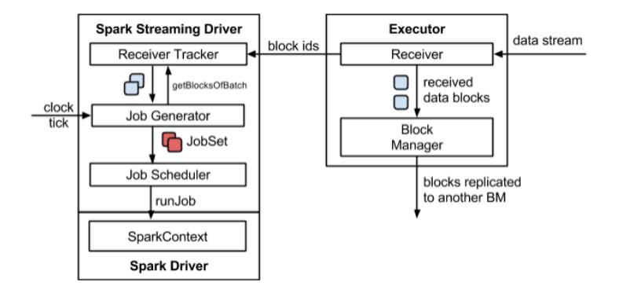
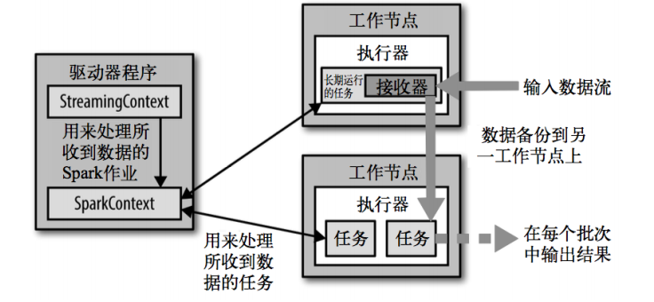
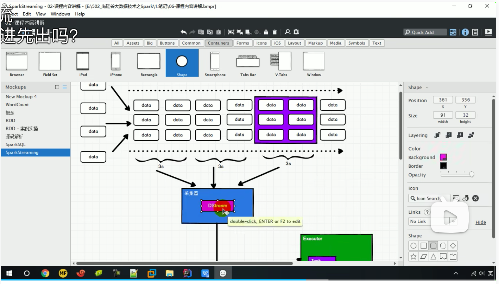
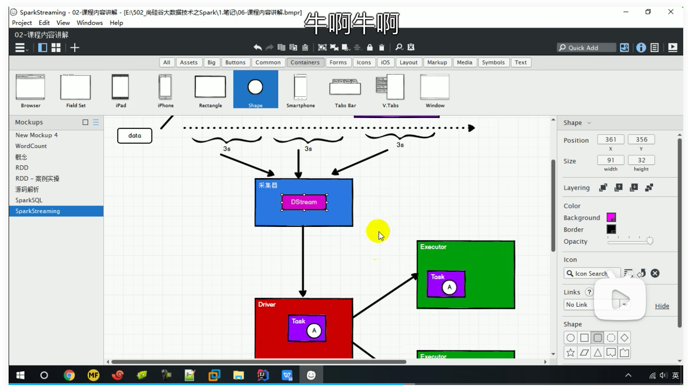

## 概念

### 数据处理方式角度

* 流式（Streaming）数据处理
* 批量（batch）数据处理

### 数据处理的延迟时间角度

* 实时数据处理：毫秒级别
* 离线数据处理：小时or天级别

SparkStreaming 是准实时（秒，分钟），微批次的数据处理框架

### 结构图









总结：在SparkCore的基础上，SparkStreaming封装了一个周期采集数据的采集器，每个周期把DataStream转为RDD再按SparkCore的流程执行任务。

### 入门案例

#### 启动netcat

```sh
nc -lk 9999
```

#### WordCount代码

```scala
def main(args: Array[String]): Unit = {
  val sparkConf = new
      SparkConf().setMaster("local[*]").setAppName("StreamWordCount")
  val ssc = new StreamingContext(sparkConf, Seconds(3))
  val lineStream: ReceiverInputDStream[String] = ssc.socketTextStream("localhost", 9999)
  val wordStream: DStream[String] = lineStream.flatMap(_.split(" "))
  val tupleStream: DStream[(String, Int)] = wordStream.map((_, 1))
  val wordCountStream: DStream[(String, Int)] = tupleStream.reduceByKey(_ + _)
  wordCountStream.print()
  ssc.start()
  ssc.awaitTermination()
}
-------------------------------------------
Time: 1689171225000 ms
-------------------------------------------

-------------------------------------------
Time: 1689171228000 ms
-------------------------------------------

-------------------------------------------
Time: 1689171231000 ms
-------------------------------------------

-------------------------------------------
Time: 1689171234000 ms
-------------------------------------------
(hello,1)
(world,1)

-------------------------------------------
Time: 1689171237000 ms
-------------------------------------------

-------------------------------------------
Time: 1689171240000 ms
-------------------------------------------

-------------------------------------------
Time: 1689171243000 ms
-------------------------------------------

-------------------------------------------
Time: 1689171246000 ms
-------------------------------------------
(a,1)

-------------------------------------------
Time: 1689171249000 ms
-------------------------------------------
(a,5)

-------------------------------------------
Time: 1689171252000 ms
-------------------------------------------

-------------------------------------------
Time: 1689171255000 ms
-------------------------------------------

-------------------------------------------
Time: 1689171258000 ms
-------------------------------------------
```