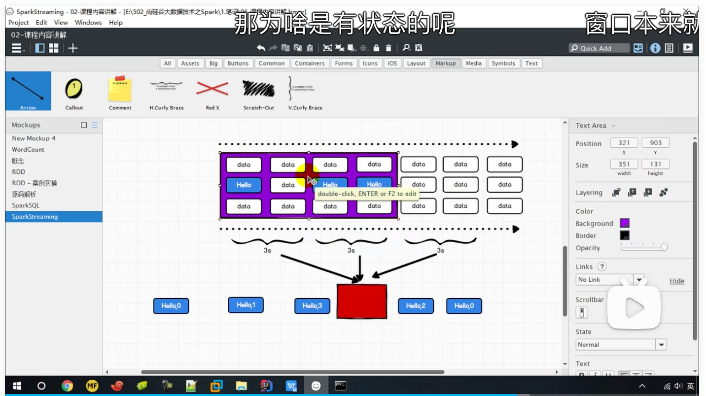

### 概念

Window Operations 可以设置窗口的大小和滑动窗口的间隔来动态的获取当前 Steaming 的允许 状态。所有基于窗口的操作都需要两个参数，分别为窗口时长以及滑动步长。

* 窗口时长：计算内容的时间范围；（窗口的范围应该是采集周期的整数倍）
* 滑动步长：隔多久触发一次计算。（窗口是可以滑动的，但是默认情况下，按照一个采集周期进行滑动）

注意：这两者都必须为采集周期大小的整数倍。

```scala
def main(args: Array[String]): Unit = {
  val sparkConf = new
      SparkConf().setMaster("local[*]").setAppName("WindowWordCount")
  val ssc = new StreamingContext(sparkConf, Seconds(3))
  val lineStream: ReceiverInputDStream[String] = ssc.socketTextStream("localhost", 9999)
  val tupleStream: DStream[(String, Int)] = lineStream.map((_, 1))
  //窗口的范围应该是采集周期的整数倍
  //窗口是可以滑动的，但是默认情况下，按照一个采集周期进行滑动
  val windowDStream: DStream[(String, Int)] = tupleStream.window(Seconds(6))
  val reduceDStream: DStream[(String, Int)] = windowDStream.reduceByKey(_ + _)
  reduceDStream.print()
  ssc.start()
  ssc.awaitTermination()
}
```

### 窗口滑动的数据重复



当滑动步长小于窗口大小时，数据有可能重复消费

当滑动步长大于或等于窗口大小时，数据不会被重复消费

```scala
val windowDStream: DStream[(String, Int)] = tupleStream.window(Seconds(6),Seconds(6))
```

### 有状态的窗口滑动计算

`reduceByKeyAndWindow(func, invFunc, windowLength, slideInterval, [numTasks])`: 这个函 数是上述函数的变化版本，每个窗口的 reduce 值都是通过用前一个窗的 reduce 值来递增计算。 通过 reduce 进入到滑动窗口数据并”反向 reduce”离开窗口的旧数据来实现这个操作。一个例 子是随着窗口滑动对 keys 的“加”“减”计数。通过前边介绍可以想到，这个函数只适用于”可逆的 reduce 函数”，也就是这些 reduce 函数有相应的”反 reduce”函数(以参数 invFunc 形式 传入)。如前述函数，reduce 任务的数量通过可选参数来配置。

```scala
def main(args: Array[String]): Unit = {
  val sparkConf = new
      SparkConf().setMaster("local[*]").setAppName("WindowWordCount")
  val ssc = new StreamingContext(sparkConf, Seconds(3))
  //有状态的计算，必须设置检查点
  ssc.checkpoint("./cp")
  val lineStream: ReceiverInputDStream[String] = ssc.socketTextStream("localhost", 9999)
  val tupleStream: DStream[(String, Int)] = lineStream.map((_, 1))
  val reduceDStream: DStream[(String, Int)] = tupleStream.reduceByKeyAndWindow(
    //其中y为新滑入的数据总和
    (x: Int, y: Int) => x + y,
    //其中y为新滑出的数据总和
    (x: Int, y: Int) => x - y,
    Seconds(9),
    Seconds(3)
  )
  reduceDStream.print()
  ssc.start()
  ssc.awaitTermination()
}
```

总结：当窗口范围比较大，但是滑动幅度比较小时，可以通过增加、减少数据的方式，减少重复计算，提升性能