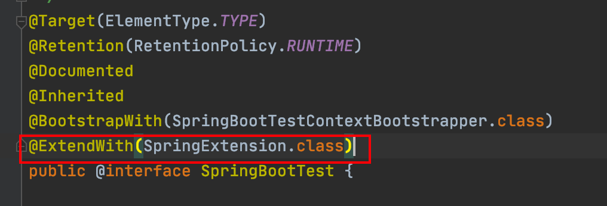
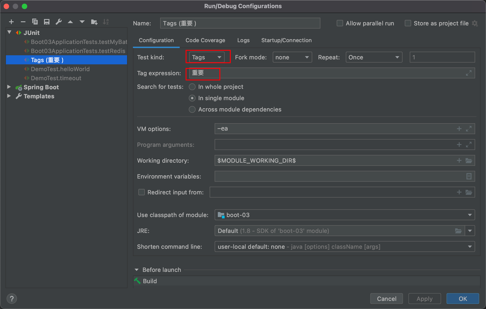

# JUnit5常用注解

JUnit5的注解与JUnit4的注解有所变化

https://junit.org/junit5/docs/current/user-guide/#writing-tests-annotations

- **@Test :**表示方法是测试方法。但是与JUnit4的@Test不同，他的职责非常单一不能声明任何属性，拓展的测试将会由Jupiter提供额外测试
- **@ParameterizedTest :**表示方法是参数化测试，下方会有详细介绍
- **@RepeatedTest :**表示方法可重复执行，下方会有详细介绍
- **@DisplayName :**为测试类或者测试方法设置展示名称
- **@BeforeEach :**表示在每个单元测试之前执行
- **@AfterEach :**表示在每个单元测试之后执行
- **@BeforeAll :**表示在所有单元测试之前执行
- **@AfterAll :**表示在所有单元测试之后执行
- **@Tag :**表示单元测试类别，类似于JUnit4中的@Categories
- **@Disabled :**表示测试类或测试方法不执行，类似于JUnit4中的@Ignore
- **@Timeout :**表示测试方法运行如果超过了指定时间将会返回错误
- **@ExtendWith :**为测试类或测试方法提供扩展类引用,例如，@SpringBootTest为复合注解，其中就包含

  

### 简单例子

```java
import org.junit.jupiter.api.Test; //注意这里使用的是jupiter的Test注解！！


public class TestDemo {

  @Test
  @DisplayName("第一次测试")
  public void firstTest() {
      System.out.println("hello world");
  }
```

### Tag注解的使用



只有被标记被“重要”的测试方法才会被执行

```java
@DisplayName("Demo测试类")
public class DemoTest {

    @Test
    @Tag("重要")
    @DisplayName("欢迎JUnit5")
    public void helloWorld(){
        System.out.println("欢迎来到JUnit5的世界");
    }

    @Test
    @Tag("重要")
    @DisplayName("做一些测试")
    public void doSomething(){
        System.out.println("开始测试");
    }

    @Test
    @DisplayName("做其他测试")
    public void doAnother(){
        System.out.println("开始其他测试");
    }

}
```