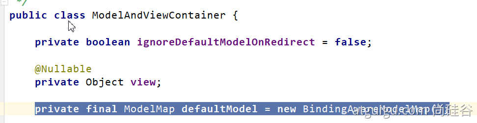
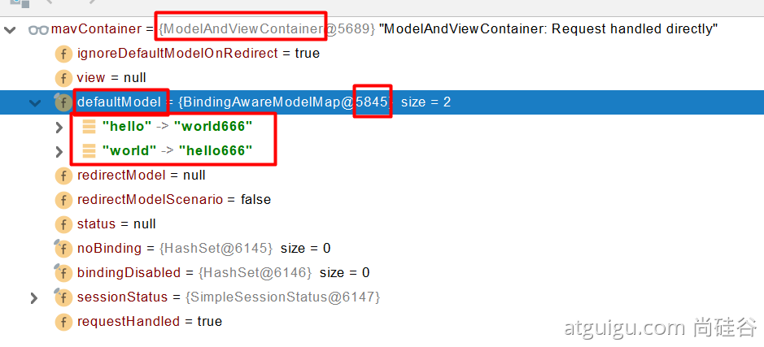

1. DispatcherServlet中doDispatch方法

2. 反射调用controller中的方法，并返回mv，mv中包含controller方法中对model的操作

   ```java
   // Actually invoke the handler.
   mv = ha.handle(processedRequest, response, mappedHandler.getHandler());
   ```

   ```java
   @GetMapping("/goto")
   public String testGoto(HttpServletRequest request, HttpServletResponse response, Map<String,Object> map, Model model){
       request.setAttribute("status",200);
       map.put("hello","xxx");
       model.addAttribute("world","yyy");
       Cookie cookie = new Cookie("c1", "v1");
       response.addCookie(cookie);
       return "forward:/success";
   }
   ```

3. 将model设置到request的attributes中(也在doDispatch)方法中

   ```java
   processDispatchResult(processedRequest, response, mappedHandler, mv, dispatchException);
   ```

4. 一些参考图片



   ### 

   ### 