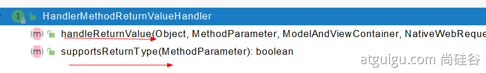

## 1、响应JSON

### 1.1、jackson.jar+@ResponseBody

```xml
<dependency>
  <groupId>org.springframework.boot</groupId>
  <artifactId>spring-boot-starter-web</artifactId>
</dependency>
web场景自动引入了json场景
<dependency>
  <groupId>org.springframework.boot</groupId>
  <artifactId>spring-boot-starter-json</artifactId>
  <version>2.3.4.RELEASE</version>
  <scope>compile</scope>
</dependency>
```

### 

给前端自动返回json数据；

#### 1、返回值解析器


```java
try {
			this.returnValueHandlers.handleReturnValue(
					returnValue, getReturnValueType(returnValue), mavContainer, webRequest);
		}
	@Override
	public void handleReturnValue(@Nullable Object returnValue, MethodParameter returnType,
			ModelAndViewContainer mavContainer, NativeWebRequest webRequest) throws Exception {

		HandlerMethodReturnValueHandler handler = selectHandler(returnValue, returnType);
		if (handler == null) {
			throw new IllegalArgumentException("Unknown return value type: " + returnType.getParameterType().getName());
		}
		handler.handleReturnValue(returnValue, returnType, mavContainer, webRequest);
	}
RequestResponseBodyMethodProcessor  	
@Override
	public void handleReturnValue(@Nullable Object returnValue, MethodParameter returnType,
			ModelAndViewContainer mavContainer, NativeWebRequest webRequest)
			throws IOException, HttpMediaTypeNotAcceptableException, HttpMessageNotWritableException {

		mavContainer.setRequestHandled(true);
		ServletServerHttpRequest inputMessage = createInputMessage(webRequest);
		ServletServerHttpResponse outputMessage = createOutputMessage(webRequest);

		// Try even with null return value. ResponseBodyAdvice could get involved.
        // 使用消息转换器进行写出操作
		writeWithMessageConverters(returnValue, returnType, inputMessage, outputMessage);
	}
```

#### 2、返回值解析器原理

### 

- 1、返回值处理器判断是否支持这种类型返回值 supportsReturnType
- 2、返回值处理器调用 handleReturnValue 进行处理
- 3、RequestResponseBodyMethodProcessor 可以处理返回值标了@ResponseBody 注解的。

- - \1.  利用 MessageConverters 进行处理 将数据写为json

- - - 1、内容协商（浏览器默认会以请求头的方式告诉服务器他能接受什么样的内容类型）
    - 2、服务器最终根据自己自身的能力，决定服务器能生产出什么样内容类型的数据，
    - 3、SpringMVC会挨个遍历所有容器底层的 HttpMessageConverter ，看谁能处理？

- - - - 1、得到MappingJackson2HttpMessageConverter可以将对象写为json
      - 2、利用MappingJackson2HttpMessageConverter将对象转为json再写出去。


### 1.2、SpringMVC到底支持哪些返回值

```java
ModelAndView
Model
View
ResponseEntity 
ResponseBodyEmitter
StreamingResponseBody
HttpEntity
HttpHeaders
Callable
DeferredResult
ListenableFuture
CompletionStage
WebAsyncTask
有 @ModelAttribute 且为对象类型的
@ResponseBody 注解 ---> RequestResponseBodyMethodProcessor；
```

### 1.3、HTTPMessageConverter原理

#### 1、MessageConverter规范


HttpMessageConverter: 看是否支持将 此 Class类型的对象，转为MediaType类型的数据。

例子：Person对象转为JSON。或者 JSON转为Person

#### 2、默认的MessageConverter


0 - 只支持Byte类型的

1 - String

2 - String

3 - Resource

4 - ResourceRegion

5 - DOMSource.**class \** SAXSource.**class**) \ StAXSource.**class \**StreamSource.**class \**Source.**class**

**6 -** MultiValueMap

7 - **true** 

**8 - true**

**9 - 支持注解方式xml处理的。**

最终 MappingJackson2HttpMessageConverter  把对象转为JSON（利用底层的jackson的objectMapper转换的）


## 