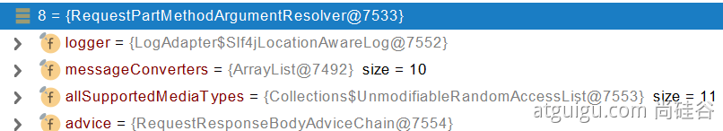

1. 后段代码

  ```java
  @PostMapping("/uploadFile")
  public String uploadFile(String email, String password, MultipartFile bgImage,MultipartFile[] photos) throws IOException {
   log.info("email:{},password:{},bgImage fileSize:{},photos size:{}",email,password,bgImage.getSize(),photos.length);
   File dir = Paths.get("/Users/yknife/cache/").toFile();
   if(!dir.exists()){
       dir.mkdirs();
   }
   if(!bgImage.isEmpty()){
       String originalFilename = bgImage.getOriginalFilename();
       String name = bgImage.getName();//返回bgImage，不常用
       bgImage.transferTo(new File("/Users/yknife/cache/"+originalFilename));
   }
   if(photos.length>0){
       for(MultipartFile file:photos){
           if(!file.isEmpty()){
               String originalFilename = file.getOriginalFilename();
               file.transferTo(new File("/Users/yknife/cache/"+originalFilename));
           }
       }
   }
   return "form/form_layouts";
  }
  ```
2. 前段代码

   ```html
   <form role="form" action="/uploadFile" method="post" enctype="multipart/form-data">
     <div class="form-group">
       <label for="exampleInputEmail1">邮件地址</label>
       <input name="email" type="email" class="form-control" id="exampleInputEmail1" placeholder="Enter email">
     </div>
     <div class="form-group">
       <label for="exampleInputPassword1">密码</label>
       <input name="password" type="password" class="form-control" id="exampleInputPassword1" placeholder="Password">
     </div>
     <div class="form-group">
       <label for="exampleInputFile">桌面背景</label>
       <input name="bgImage" type="file" id="exampleInputFile">
       <p class="help-block">Example block-level help text here.</p>
     </div>
     <div class="form-group">
       <label for="exampleInputFile">生活照</label>
       <input name="photos" type="file" id="exampleInputFile1" multiple>
       <p class="help-block">Example block-level help text here.</p>
     </div>
     <div class="checkbox">
       <label>
         <input type="checkbox"> Check me out
       </label>
     </div>
     <button type="submit" class="btn btn-primary">Submit</button>
   </form>
   ```

3. 原理

   **文件上传自动配置类-MultipartAutoConfiguration-****MultipartProperties**

   - 自动配置好了 **StandardServletMultipartResolver   【文件上传解析器】**

   - **原理步骤**

     - 1、请求进来使用文件上传解析器判断（**isMultipart**）并封装（**resolveMultipart，**返回**MultipartHttpServletRequest**）文件上传请求
     - RequestParamMethodArgumentResolver可以解析MultiPart请求，将请求中的文件封装到multiPartFile中

     

4. 也可使用RequestPart注解

   ```java
   @PostMapping("/upload")
   public String upload(@RequestParam("email") String email,
                        @RequestParam("username") String username,
                        @RequestPart("headerImg") MultipartFile headerImg,
                        @RequestPart("photos") MultipartFile[] photos)
   ```

   与之对应的解析器是

   
