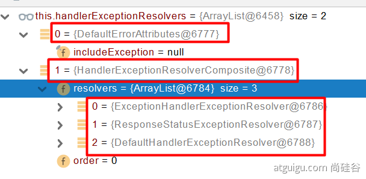
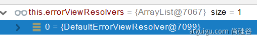

#### 异常处理步骤流程

1、执行目标方法，目标方法运行期间有任何异常都会被catch、而且标志当前请求结束；并且用 **dispatchException** 

2、进入视图解析流程（页面渲染？） 

processDispatchResult(processedRequest, response, mappedHandler, **mv**, **dispatchException**);

3、**mv** = **processHandlerException**；处理handler发生的异常，处理完成返回ModelAndView；

- 1、遍历所有的 **handlerExceptionResolvers，看谁能处理当前异常【****HandlerExceptionResolver处理器异常解析器****】**
- 
- **2、系统默认的  异常解析器；**
- 

- - **1、DefaultErrorAttributes先来处理异常。把异常信息保存到rrequest域，并且返回null；**
  - **2、默认没有任何人能处理异常，所以异常会被抛出**

- - - **1、如果没有任何人能处理最终底层就会发送 /error 请求。会被底层的BasicErrorController处理**
    - **2、解析错误视图；遍历所有的**  **ErrorViewResolver  看谁能解析。**
    - 
    - **3、默认的** **DefaultErrorViewResolver ,作用是把响应状态码作为错误页的地址，error/500.html** 
    - **4、模板引擎最终响应这个页面** **error/500.html** 