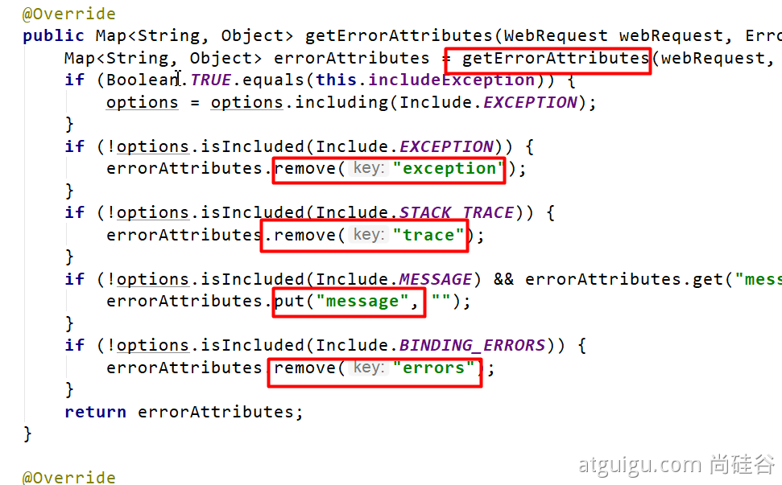
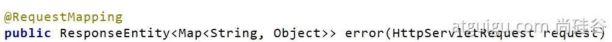
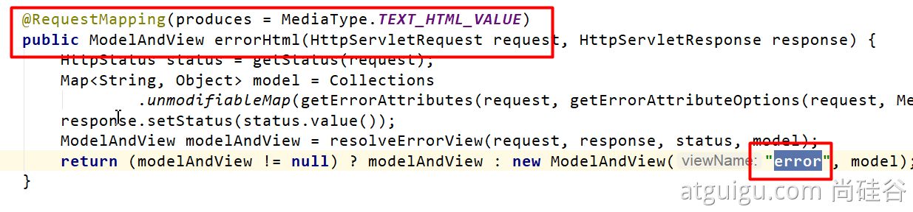

#### 异常处理自动配置原理

- **ErrorMvcAutoConfiguration  自动配置异常处理规则**

- - **容器中的组件：类型：DefaultErrorAttributes ->** **id：errorAttributes**

- - - **public class** **DefaultErrorAttributes** **implements** **ErrorAttributes**, **HandlerExceptionResolver**
    - **DefaultErrorAttributes**：定义错误页面中可以包含哪些数据。
    - 
    - 

- - **容器中的组件：类型：****BasicErrorController --> id：basicErrorController（json+白页 适配响应）**

- - - **处理默认** **/error 路径的请求；页面响应** **new** ModelAndView(**"error"**, model)；
    - **容器中有组件 View**->**id是error**；（响应默认错误页）
    - 容器中放组件 **BeanNameViewResolver（视图解析器）；按照返回的视图名作为组件的id去容器中找View对象。**

- - **容器中的组件：**类型：**DefaultErrorViewResolver -> id：**conventionErrorViewResolver

- - - 如果发生错误，会以HTTP的状态码 作为视图页地址（viewName），找到真正的页面
    - error/404、5xx.html

如果想要返回页面；就会找error视图【**StaticView**】。(默认是一个白页)

写出去json

 错误页