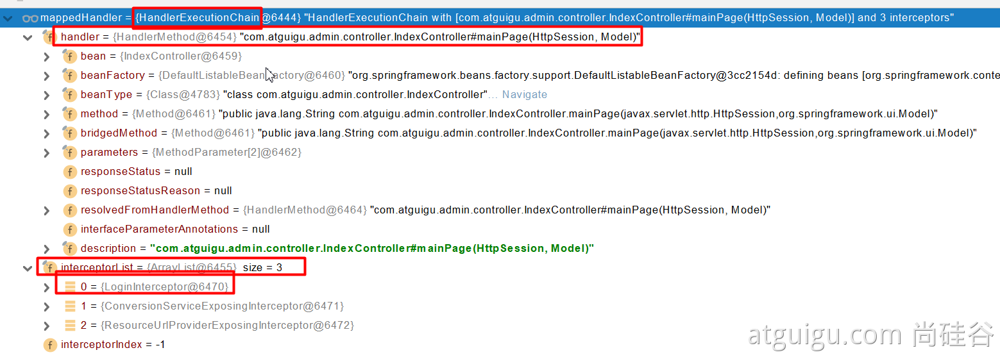

## 拦截器原理

1、根据当前请求，找到**HandlerExecutionChain【**可以处理请求的handler以及handler的所有 拦截器】

2、先来**顺序执行** 所有拦截器的 preHandle方法

- 1、如果当前拦截器prehandler返回为true。则执行下一个拦截器的preHandle
- 2、如果当前拦截器返回为false。直接    倒序执行所有已经执行了的拦截器的  afterCompletion；

**3、如果任何一个拦截器返回false。直接跳出不执行目标方法**

**4、所有拦截器都返回True。执行目标方法**

**5、倒序执行所有拦截器的postHandle方法。**

**6、前面的步骤有任何异常都会直接倒序触发** afterCompletion

7、页面成功渲染完成以后，也会倒序触发 afterCompletion

# 