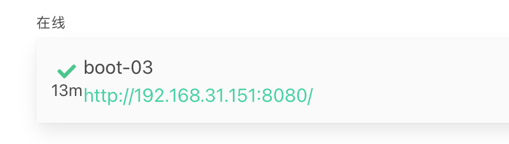

1. springbootadmin项目地址

   https://github.com/codecentric/spring-boot-admin

2. server项目引入依赖

   ```xml
   <dependency>
       <groupId>de.codecentric</groupId>
       <artifactId>spring-boot-admin-starter-server</artifactId>
       <version>2.6.6</version>
   </dependency>
   ```

3. client项目引入依赖

   ```xml
   <dependency>
       <groupId>de.codecentric</groupId>
       <artifactId>spring-boot-admin-starter-client</artifactId>
       <version>2.6.6</version>
   </dependency>
   ```

4. client配置

   ```yaml
   spring:
     boot:
       admin:
         client:
           url: http://localhost:8888 #设置服务端ip
           instance:
             service-host-type: ip #设置本微服务暴露ip还是hostname
     application:
       name: boot-03 #应用名称
   ```

   

   


