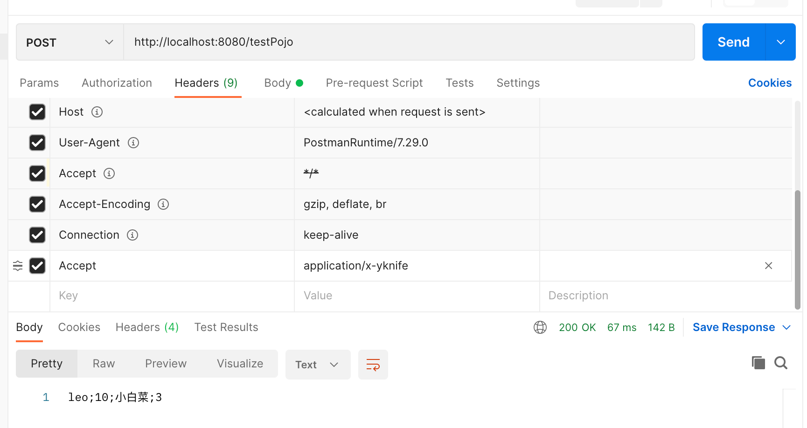

### 自定义 MessageConverter

**实现多协议数据兼容。json、xml、x-guigu**

**0、**@ResponseBody 响应数据出去 调用 **RequestResponseBodyMethodProcessor** 处理

1、Processor 处理方法返回值。通过 **MessageConverter** 处理

2、所有 **MessageConverter** 合起来可以支持各种媒体类型数据的操作（读、写）

3、内容协商找到最终的 **messageConverter**；

SpringMVC的什么功能。一个入口给容器中添加一个  WebMvcConfigurer

```java
 @Bean
    public WebMvcConfigurer webMvcConfigurer(){
        return new WebMvcConfigurer() {

            @Override
            public void extendMessageConverters(List<HttpMessageConverter<?>> converters) {

            }
        }
    }
```


代码例子：

* SpringBoot配置

```java
@Configuration(proxyBeanMethods = false)
public class WebConfig{

    @Bean
    public WebMvcConfigurer webMvcConfigurer(){
        return new WebMvcConfigurer() {
            @Override
            public void extendMessageConverters(List<HttpMessageConverter<?>> converters) {
                converters.add(new YKNIFEHttpMessageConverter());
            }
        };
    }
}
```

* 自定义converter实现

```java
public class YKNIFEHttpMessageConverter implements HttpMessageConverter<Person> {

    @Override
    public boolean canRead(Class<?> clazz, MediaType mediaType) {
        return false;
    }

    @Override
    public boolean canWrite(Class<?> clazz, MediaType mediaType) {
        return clazz.isAssignableFrom(Person.class);//定义被转换类型
    }

    @Override
    public List<MediaType> getSupportedMediaTypes() {
        return MediaType.parseMediaTypes("application/x-yknife");//自定义内容协商类型
    }

    @Override
    public Person read(Class<? extends Person> clazz, HttpInputMessage inputMessage) throws IOException, HttpMessageNotReadableException {
        return null;
    }

    @Override
    public void write(Person person, MediaType contentType, HttpOutputMessage outputMessage) throws IOException, HttpMessageNotWritableException {
        String str = person.getName()+";"+person.getAge()+";"+person.getPet().getName()+";"+person.getPet().getAge();
        OutputStream body = outputMessage.getBody();
        body.write(str.getBytes());//写出转换后的数据
    }
}
```



