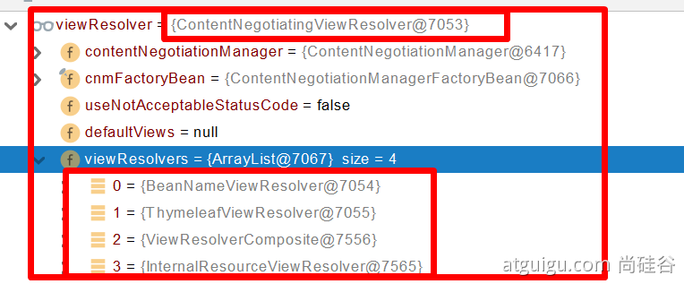

### 视图解析原理流程

1、目标方法处理的过程中，所有数据都会被放在 **ModelAndViewContainer 里面。包括数据和视图地址**

**2、方法的参数是一个自定义类型对象（从请求参数中确定的），把他重新放在** **ModelAndViewContainer** 

**3、任何目标方法执行完成以后都会返回 ModelAndView（****数据和视图地址****）。**

**4、****processDispatchResult  处理派发结果（页面改如何响应）**

- 1、**render**(**mv**, request, response); 进行页面渲染逻辑

- - 1、根据方法的String返回值得到 **View** 对象【定义了页面的渲染逻辑】

- - - 1、所有的视图解析器尝试是否能根据当前返回值得到**View**对象
    - 2、得到了  **redirect:/main.html** --> Thymeleaf new **RedirectView**()
    - 3、ContentNegotiationViewResolver 里面包含了下面所有的视图解析器，内部还是利用下面所有视图解析器得到视图对象。
    - 4、view.render(mv.getModelInternal(), request, response);   视图对象调用自定义的render进行页面渲染工作

- - - - **RedirectView 如何渲染【重定向到一个页面】**
      - **1、获取目标url地址**
      - **2、****response.sendRedirect(encodedURL);**

**视图解析：**

- - **返回值以 forward: 开始： new InternalResourceView(forwardUrl); -->  转发****request.getRequestDispatcher(path).forward(request, response);** 
  - **返回值以** **redirect: 开始：** **new RedirectView() --》 render就是重定向** 
  - **返回值是普通字符串： new ThymeleafView（）--->** 

