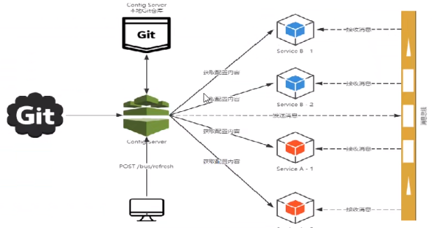

一言以蔽之，分布式自动刷新配置功能。

Spring Cloud Bus配合Spring Cloud Config使用可以实现配置的动态刷新。

**是什么**

Spring Cloud Bus 配合Spring Cloud Config 使用可以实现配置的动态刷新。

Spring Cloud Bus是用来将分布式系统的节点与轻量级消息系统链接起来的框架，它整合了Java的事件处理机制和消息中间件的功能。Spring Clud Bus目前支持RabbitMQ和Kafka。

**能干嘛**

Spring Cloud Bus能管理和传播分布式系统间的消息，就像一个分布式执行器，可用于广播状态更改、事件推送等，也可以当作微服务间的通信通道。

为何被称为总线

**什么是总线**

在微服务架构的系统中，通常会使用轻量级的消息代理来构建一个共用的消息主题，并让系统中所有微服务实例都连接上来。由于该主题中产生的消息会被所有实例监听和消费，所以称它为消息总线。在总线上的各个实例，都可以方便地广播一些需要让其他连接在该主题上的实例都知道的消息。

**基本原理**

ConfigClient实例都监听MQ中同一个topic(默认是Spring Cloud Bus)。当一个服务刷新数据的时候，它会把这个信息放入到Topic中，这样其它监听同一Topic的服务就能得到通知，然后去更新自身的配置。
