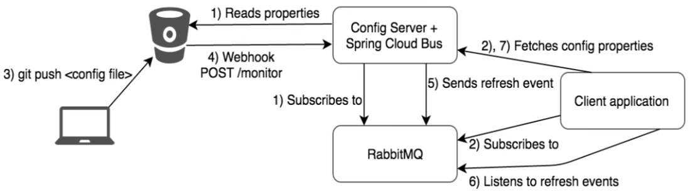

### 不想全部通知，只想定点通知

* 只通知3355
* 不通知3366

简单一句话 - 指定具体某一个实例生效而不是全部

> 公式：http://localhost:3344/actuator/bus-refresh/{destination}

/bus/refresh请求不再发送到具体的服务实例上，而是发给config server通过destination参数类指定需要更新配置的服务或实例

### 案例

我们这里以刷新运行在3355端口上的config-client（配置文件中设定的应用名称）为例，只通知3355，不通知3366

```sh
curl -X POST "http://localhost:3344/actuator/bus-refresh/config-client:3355
```

### 通知总结

