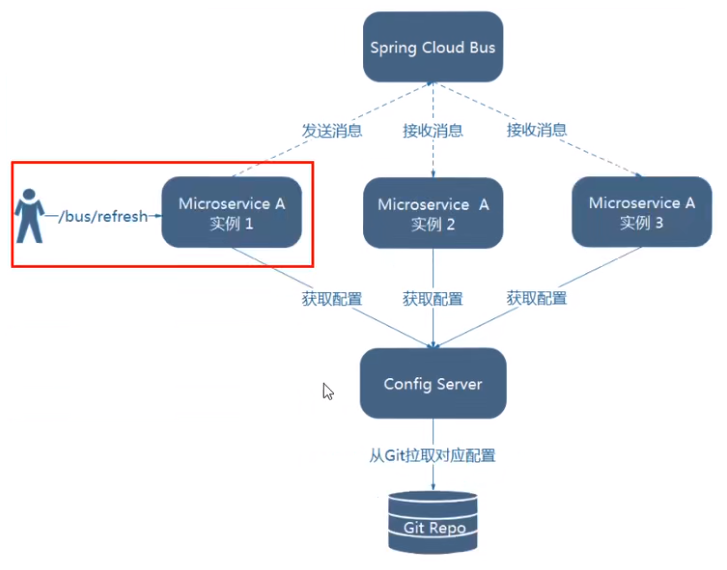
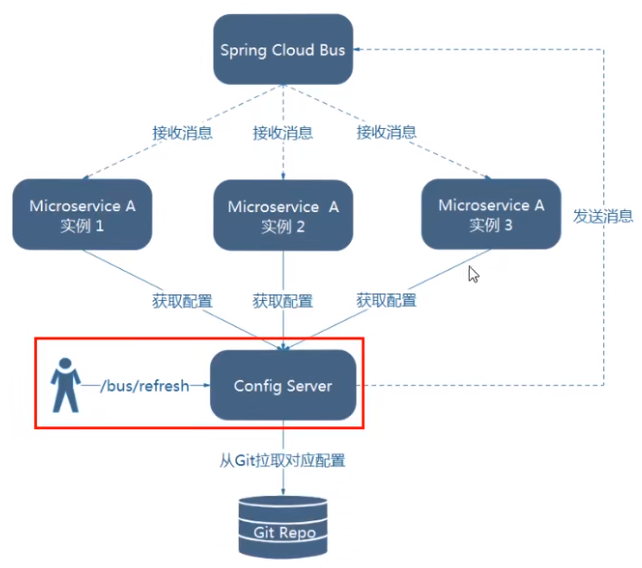

1. 新建cloud-config-client-3366

2. POM

   ```xml
   <?xml version="1.0" encoding="UTF-8"?>
   <project xmlns="http://maven.apache.org/POM/4.0.0"
            xmlns:xsi="http://www.w3.org/2001/XMLSchema-instance"
            xsi:schemaLocation="http://maven.apache.org/POM/4.0.0 http://maven.apache.org/xsd/maven-4.0.0.xsd">
       <parent>
           <artifactId>cloud2022</artifactId>
           <groupId>org.example</groupId>
           <version>1.0-SNAPSHOT</version>
       </parent>
       <modelVersion>4.0.0</modelVersion>
   
       <artifactId>cloud-config-client-3366</artifactId>
   
       <dependencies>
           <!--添加消息总线RabbitMQ支持-->
           <dependency>
               <groupId>org.springframework.cloud</groupId>
               <artifactId>spring-cloud-starter-bus-amqp</artifactId>
           </dependency>
           <dependency>
               <groupId>org.springframework.cloud</groupId>
               <artifactId>spring-cloud-starter-config</artifactId>
           </dependency>
           <dependency>
               <groupId>org.springframework.cloud</groupId>
               <artifactId>spring-cloud-starter-netflix-eureka-client</artifactId>
           </dependency>
           <dependency>
               <groupId>org.springframework.boot</groupId>
               <artifactId>spring-boot-starter-web</artifactId>
           </dependency>
           <dependency>
               <groupId>org.springframework.boot</groupId>
               <artifactId>spring-boot-starter-actuator</artifactId>
           </dependency>
   
           <dependency>
               <groupId>org.springframework.boot</groupId>
               <artifactId>spring-boot-devtools</artifactId>
               <scope>runtime</scope>
               <optional>true</optional>
           </dependency>
           <dependency>
               <groupId>org.projectlombok</groupId>
               <artifactId>lombok</artifactId>
               <optional>true</optional>
           </dependency>
           <dependency>
               <groupId>org.springframework.boot</groupId>
               <artifactId>spring-boot-starter-test</artifactId>
               <scope>test</scope>
           </dependency>
       </dependencies>
   
   </project>
   ```

3. 添加bootstrap.yaml

   ```yaml
   server:
     port: 3366
   
   spring:
     application:
       name: config-client
     cloud:
       #Config客户端配置
       config:
         label: master #分支名称
         name: config #配置文件名称
         profile: dev #读取后缀名称   上述3个综合：master分支上config-dev.yml的配置文件被读取http://config-3344.com:3344/master/config-dev.yml
         uri: http://localhost:3344 #配置中心地址
   
     #rabbitmq相关配置 15672是Web管理界面的端口；5672是MQ访问的端口
     rabbitmq:
       host: localhost
       port: 5672
       username: guest
       password: guest
   
   #服务注册到eureka地址
   eureka:
     client:
       service-url:
         defaultZone: http://localhost:7001/eureka
   
   # 暴露监控端点
   management:
     endpoints:
       web:
         exposure:
           include: "*"
   ```

4. 主启动

   ```java
   import org.springframework.boot.SpringApplication;
   import org.springframework.boot.autoconfigure.SpringBootApplication;
   import org.springframework.cloud.netflix.eureka.EnableEurekaClient;
   
   @EnableEurekaClient
   @SpringBootApplication
   public class ConfigClientMain3366
   {
       public static void main(String[] args)
       {
           SpringApplication.run(ConfigClientMain3366.class,args);
       }
   }
   ```

5. controller

   ```java
   import org.springframework.beans.factory.annotation.Value;
   import org.springframework.cloud.context.config.annotation.RefreshScope;
   import org.springframework.web.bind.annotation.GetMapping;
   import org.springframework.web.bind.annotation.RestController;
   
   /**
    */
   @RestController
   @RefreshScope
   public class ConfigClientController
   {
       @Value("${server.port}")
       private String serverPort;
   
       @Value("${config.info}")
       private String configInfo;
   
       @GetMapping("/configInfo")
       public String configInfo()
       {
           return "serverPort: "+serverPort+"\t\n\n configInfo: "+configInfo;
       }
   
   }
   ```

6. **设计思想**

   1.利用消息总线触发一个客户端/bus/refresh,而刷新所有客户端的配置

   

   2. 利用消息总线触发一个服务端ConfigServer的/bus/refresh端点，而刷新所有客户端的配置

      

   图二的架构显然更加适合，图—不适合的原因如下：

   * 打破了微服务的职责单一性，因为微服务本身是业务模块，它本不应该承担配置刷新的职责。
   * 破坏了微服务各节点的对等性。
   * 有一定的局限性。例如，微服务在迁移时，它的网络地址常常会发生变化，此时如果想要做到自动刷新，那就会增加更多的修改。

7. **给cloud-config-center-3344配置中心服务端添加消息总线支持**

   ```xml
   <dependency>
       <groupId>org.springframework.cloud</groupId>
       <artifactId>spring-cloud-starter-bus-amqp</artifactId>
   </dependency>
   <dependency>
     <groupId>org.springframework.boot</groupId>
     <artifactId>spring-boot-starter-actuator</artifactId>
   </dependency>
   ```

8. 修改3344的yaml

   ```yaml
   server:
     port: 3344
   
   spring:
     application:
       name:  cloud-config-center #注册进Eureka服务器的微服务名
     cloud:
       config:
         server:
           git:
             uri: git@github.com:yknife/springcloud-config.git #GitHub上面的git仓库名字
             ####搜索目录
             search-paths:
               - springcloud-config
         ####读取分支
         label: master
     #### @增加mq配置    
     rabbitmq:
       host: localhost
       port: 5672
       username: guest
       password: guest
   
   #服务注册到eureka地址
   eureka:
     client:
       service-url:
         defaultZone: http://localhost:7001/eureka
   #### @暴露bus-refresh端点      
   management:
     endpoints: #暴露bus刷新配置的端点
       web:
         exposure:
           include: 'bus-refresh'
   ```

9. **给cloud-config-client-3355客户端添加消息总线支持**

   ```xml
   <dependency>
       <groupId>org.springframework.cloud</groupId>
       <artifactId>spring-cloud-starter-bus-amqp</artifactId>
   </dependency>
   <dependency>
   	<groupId>org-springframework.boot</groupId>
   	<artifactId>spring-boot-starter-actuator</artifactId>
   </dependency>
   ```

10. 修改yaml

    ```yaml
    server:
      port: 3355
    
    spring:
      application:
        name: config-client
      cloud:
        #Config客户端配置
        config:
          label: master #分支名称
          name: config #配置文件名称
          profile: dev #读取后缀名称   上述3个综合：master分支上config-dev.yml的配置文件被读取http://config-3344.com:3344/master/config-dev.yml
          uri: http://localhost:3344 #配置中心地址k
      #### @增加mq配置    
      rabbitmq:
        host: localhost
        port: 5672
        username: guest
        password: guest
    
    #服务注册到eureka地址
    eureka:
      client:
        service-url:
          defaultZone: http://localhost:7001/eureka
    
    management:
      endpoints:
        web:
          exposure:
            include: "*"
    ```

11. 测试

    **启动**

    * EurekaMain7001
    * ConfigcenterMain3344
    * ConfigclientMain3355
    * ConfigclicntMain3366

    **运维工程师**

    * 修改Github上配置文件内容，增加版本号
    * 发送POST请求
      curl -X POST "http://localhost:3344/actuator/bus-refresh"
      —次发送，处处生效

    **配置中心**

    * http://config-3344.com:3344/config-dev.yml

    **客户端**

    * http://localhost:3355/configlnfo
    * http://localhost:3366/configInfo
      获取配置信息，发现都已经刷新了
      