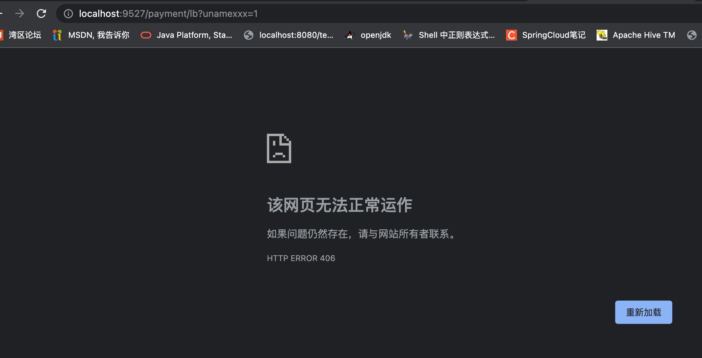

## GateWay的Filter

[官方文档](https://cloud.spring.io/spring-cloud-static/spring-cloud-gateway/2.2.1.RELEASE/reference/html/#gatewayfilter-factories)

> Route filters allow the modification of the incoming HTTP request or outgoing HTTP response in some manner. Route filters are scoped to a particular route. Spring Cloud Gateway includes many built-in GatewayFilter Factories.

路由过滤器可用于修改进入的HTTP请求和返回的HTTP响应，路由过滤器只能指定路由进行使用。Spring Cloud Gateway内置了多种路由过滤器，他们都由GatewayFilter的工厂类来产生。

Spring Cloud Gateway的Filter:

* 生命周期：

  * pre

  * post

* 种类（具体看官方文档）：

  * GatewayFilter - 有31种

  * GlobalFilter - 有10种


常用的GatewayFilter：AddRequestParameter GatewayFilter

自定义全局GlobalFilter：

两个主要接口介绍：

1. GlobalFilter

2. Ordered

能干什么：

1. 全局日志记录

2. 统一网关鉴权
   …

代码案例：

GateWay9527项目添加MyLogGateWayFilter类：

```java
package com.example.cloud.filter;
import lombok.extern.slf4j.Slf4j;
import org.springframework.cloud.gateway.filter.GatewayFilterChain;
import org.springframework.cloud.gateway.filter.GlobalFilter;
import org.springframework.core.Ordered;
import org.springframework.http.HttpStatus;
import org.springframework.stereotype.Component;
import org.springframework.web.server.ServerWebExchange;
import reactor.core.publisher.Mono;

import java.util.Date;

@Component
@Slf4j
public class MyLogGateWayFilter implements GlobalFilter,Ordered
{

    @Override
    public Mono<Void> filter(ServerWebExchange exchange, GatewayFilterChain chain)
    {
        log.info("***********come in MyLogGateWayFilter:  "+new Date());

        String uname = exchange.getRequest().getQueryParams().getFirst("uname");

        if(uname == null)
        {
            log.info("*******用户名为null，非法用户，o(╥﹏╥)o");
            exchange.getResponse().setStatusCode(HttpStatus.NOT_ACCEPTABLE);
            return exchange.getResponse().setComplete();
        }

        return chain.filter(exchange);
    }

    @Override
    public int getOrder()
    {
        return 0;
    }
}
```

测试：

启动：

* EurekaMain7001
* PaymentMain8001
* GateWayMain9527
* PaymentMain8002

浏览器输入：

* http://localhost:9527/payment/lb - 反问异常

  

* http://localhost:9527/payment/lb?uname=abc - 正常反问
  