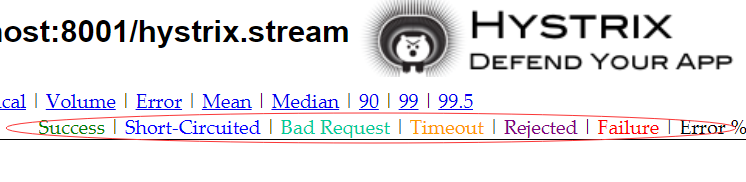
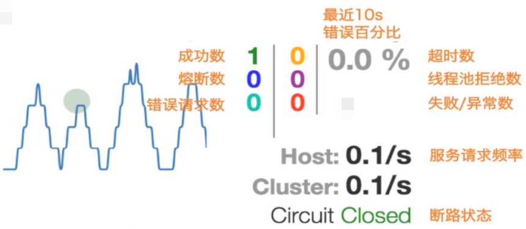

1. 新建cloud-consumer-hystrix-dashboard9001

2. 引入依赖

   ```xml
   <?xml version="1.0" encoding="UTF-8"?>
   <project xmlns="http://maven.apache.org/POM/4.0.0"
            xmlns:xsi="http://www.w3.org/2001/XMLSchema-instance"
            xsi:schemaLocation="http://maven.apache.org/POM/4.0.0 http://maven.apache.org/xsd/maven-4.0.0.xsd">
       <parent>
           <artifactId>cloud2022</artifactId>
           <groupId>org.example</groupId>
           <version>1.0-SNAPSHOT</version>
       </parent>
       <modelVersion>4.0.0</modelVersion>
   
       <artifactId>cloud-consumer-hystrix-dashboard9001</artifactId>
   
       <dependencies>
           <dependency>
               <groupId>org.springframework.cloud</groupId>
               <artifactId>spring-cloud-starter-netflix-hystrix-dashboard</artifactId>
           </dependency>
           <dependency>
               <groupId>org.springframework.boot</groupId>
               <artifactId>spring-boot-starter-actuator</artifactId>
           </dependency>
   
           <dependency>
               <groupId>org.springframework.boot</groupId>
               <artifactId>spring-boot-devtools</artifactId>
               <scope>runtime</scope>
               <optional>true</optional>
           </dependency>
           <dependency>
               <groupId>org.projectlombok</groupId>
               <artifactId>lombok</artifactId>
               <optional>true</optional>
           </dependency>
           <dependency>
               <groupId>org.springframework.boot</groupId>
               <artifactId>spring-boot-starter-test</artifactId>
               <scope>test</scope>
           </dependency>
       </dependencies>
   
   </project>
   ```

3. 添加yaml

   ```yaml
   server:
     port: 9001
   ```

4. 启动类

   ```java
   import org.springframework.boot.SpringApplication;
   import org.springframework.boot.autoconfigure.SpringBootApplication;
   import org.springframework.cloud.netflix.hystrix.dashboard.EnableHystrixDashboard;
   
   @SpringBootApplication
   @EnableHystrixDashboard
   public class HystrixDashboardMain9001
   {
       public static void main(String[] args) {
           SpringApplication.run(HystrixDashboardMain9001.class, args);
       }
   }
   ```

5. 所有Provider微服务提供类(8001/8002/8003)都需要监控依赖配置

   ```xml
   <dependency>
       <groupId>org.springframework.boot</groupId>
       <artifactId>spring-boot-starter-actuator</artifactId>
   </dependency>
   ```

6. 6.启动cloud-consumer-hystrix-dashboard9001该微服务后续将监控微服务8001

   浏览器输入http://localhost:9001/hystrix

7. 修改**cloud-provider-hystrix-payment8001**

   注意：新版本Hystrix需要在主启动类PaymentHystrixMain8001中指定监控路径

   ```java
   import com.netflix.hystrix.contrib.metrics.eventstream.HystrixMetricsStreamServlet;
   import org.springframework.boot.SpringApplication;
   import org.springframework.boot.autoconfigure.SpringBootApplication;
   import org.springframework.boot.web.servlet.ServletRegistrationBean;
   import org.springframework.cloud.client.circuitbreaker.EnableCircuitBreaker;
   import org.springframework.cloud.netflix.eureka.EnableEurekaClient;
   import org.springframework.context.annotation.Bean;
   
   @SpringBootApplication
   @EnableEurekaClient
   @EnableCircuitBreaker
   public class PaymentHystrixMain8001
   {
       public static void main(String[] args) {
               SpringApplication.run(PaymentHystrixMain8001.class, args);
       }
   
   
       /**
        *此配置是为了服务监控而配置，与服务容错本身无关，springcloud升级后的坑
        *ServletRegistrationBean因为springboot的默认路径不是"/hystrix.stream"，
        *只要在自己的项目里配置上下面的servlet就可以了
        *否则，Unable to connect to Command Metric Stream 404
        */
       @Bean
       public ServletRegistrationBean getServlet() {
           HystrixMetricsStreamServlet streamServlet = new HystrixMetricsStreamServlet();
           ServletRegistrationBean registrationBean = new ServletRegistrationBean(streamServlet);
           registrationBean.setLoadOnStartup(1);
           registrationBean.addUrlMappings("/hystrix.stream");
           registrationBean.setName("HystrixMetricsStreamServlet");
           return registrationBean;
       }
   }
   ```

8. 测试

   监控测试

   启动1个eureka

   启动8001，9001

   观察监控窗口

   9001监控8001 - 填写监控地址 - http://localhost:8001/hystrix.stream 到 http://localhost:9001/hystrix页面的输入框。

   测试地址

   http://localhost:8001/payment/circuit/1

   http://localhost:8001/payment/circuit/-1

   测试通过

   先访问正确地址，再访问错误地址，再正确地址，会发现图示断路器都是慢慢放开的。

9. 页面展示

   

   **如何看?**

   - 7色

   

   - 1圈

     实心圆：共有两种含义。它通过颜色的变化代表了实例的健康程度，它的健康度从绿色<黄色<橙色<红色递减。

     该实心圆除了颜色的变化之外，它的大小也会根据实例的请求流量发生变化，**流量越大该实心圆就越大**。所以通过该实心圆的展示，就可以在大量的实例中快速的发现故障实例和高压力实例。

   - 1线

     曲线：用来记录2分钟内流量的相对变化，可以通过它来观察到流量的上升和下降趋势。

   - 整图说明

     

   - 整图说明2

     