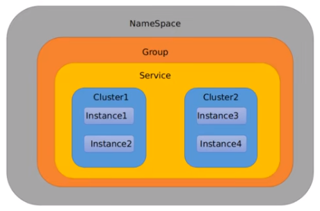

**Namespace+Group+Data lD三者关系？为什么这么设计？**

1. 是什么

   类似Java里面的package名和类名最外层的namespace是可以用于区分部署环境的，Group和DatalD逻辑上区分两个目标对象。

2. 三者情况

   

   默认情况：Namespace=public，Group=DEFAULT_GROUP，默认Cluster是DEFAULT

   * Nacos默认的Namespace是public，Namespace主要用来实现隔离。
     比方说我们现在有三个环境：开发、测试、生产环境，我们就可以创建三个Namespace，不同的Namespace之间是隔离的。
   * Group默认是DEFAULT_GROUP，Group可以把不同的微服务划分到同一个分组里面去
   * Service就是微服务:一个Service可以包含多个Cluster (集群)，Nacos默认Cluster是DEFAULT，Cluster是对指定微服务的一个虚拟划分。
   * 比方说为了容灾，将Service微服务分别部署在了杭州机房和广州机房，这时就可以给杭州机房的Service微服务起一个集群名称(HZ) ，给广州机房的Service微服务起一个集群名称(GZ)，还可以尽量让同一个机房的微服务互相调用，以提升性能。
     最后是Instance，就是微服务的实例。

3. yaml

   ```yaml
   # nacos配置
   server:
     port: 3377
   
   spring:
     application:
       name: nacos-config-client
     cloud:
       nacos:
         discovery:
           server-addr: localhost:8848 #Nacos服务注册中心地址
         config:
           server-addr: localhost:8848 #Nacos作为配置中心地址
           file-extension: yaml #指定yaml格式的配置
           group: DEV_GROUP
           namespace: 7d8f0f5a-6a53-4785-9686-dd460158e5d4 #<------------指定namespace
   
   
   # ${spring.application.name}-${spring.profile.active}.${spring.cloud.nacos.config.file-extension}
   # nacos-config-client-dev.yaml
   
   # nacos-config-client-test.yaml   ----> config.info
   ```

   