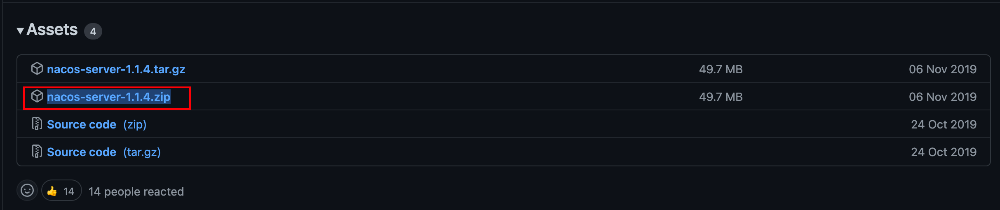
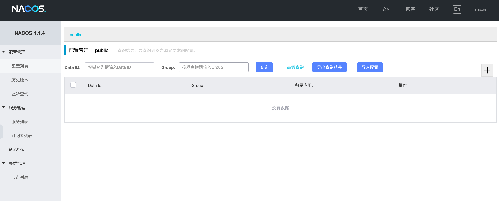

## Nacos安装

1. 下载

   [1.1.4版本](https://github.com/alibaba/nacos/releases/tag/1.1.4)

   

2. 解压、启动

   ```sh
   sh startup.sh -m standalone
   ```

## 踩坑

1. mac 启动nacos失败 日志报“nohup: /Library/Internet: No such file or directory”

   > 之后查看logs/start.out发现报如下日志
   >
   > /Library/Internet Plug-Ins/JavaAppletPlugin.plugin/Contents/Home/bin/java -Xms512m -Xmx512m -Xmn256m -Dnacos.standalone=true -Dnacos.member.list= -Djava.ext.dirs=/Library/Internet Plug-Ins/JavaAppletPlugin.plugin/Contents/Home/jre/lib/ext:/Library/Internet Plug-Ins/JavaAppletPlugin.plugin/Contents/Home/lib/ext -Xloggc:/Users/mac/Download/nacos/logs/nacos_gc.log -verbose:gc -XX:+PrintGCDetails -XX:+PrintGCDateStamps -XX:+PrintGCTimeStamps -XX:+UseGCLogFileRotation -XX:NumberOfGCLogFiles=10 -XX:GCLogFileSize=100M -Dloader.path=/Users/mac/Download/nacos/plugins/health,/Users/mac/Download/nacos/plugins/cmdb -Dnacos.home=/Users/mac/Download/nacos -jar /Users/mac/Download/nacos/target/nacos-server.jar --spring.config.location=classpath:/,classpath:/config/,file:./,file:./config/,file:/Users/mac/Download/nacos/conf/ --logging.config=/Users/mac/Download/nacos/conf/nacos-logback.xml --server.max-http-header-size=524288
   >
   > nohup: /Library/Internet: No such file or directory

   nacos没有找到jdk路径

2. 添加环境变量，vim ~/.bash_profile

   ```sh
   JAVA_HOME=/Library/Java/JavaVirtualMachines/jdk1.8.0_261.jdk/Contents/Home
   CLASSPATH=$JAVA_HOME/lib/tools.jar:$JAVA_HOME/lib/dt.jar:.
   PATH=$JAVA_HOME/bin:$PATH:.
   export JAVA_HOME
   export PATH
   export CLASSPATH
   ```

   没发现异常，确认一下

   echo $JAVA_HOME

   **没有任何输出！！**

   source ～/.bash_profile

   echo $JAVA_HOME

   ```sh
   /Library/Java/JavaVirtualMachines/jdk1.8.0_261.jdk/Contents/Home
   ```

   再去启动nacos，还是老样子！！再次确认环境变量 ehco $JAVA_HOME

   **又没有任何输出！！！**

   问题找到了，经过一番查阅资料得出结论，如果mac用户使用的是zsh作为默认shell工具使用指令source时仅对当前会话生效，关闭当前zsh终端再重新打开一个终端上次配置的环境变量会失效！

   因此需要增加如下配置

   vim ~/.zshrc

   在开头添加

   ```sh
   if [ -f ~/.bash_profile ]; then
      source ~/.bash_profile
   fi
   ```

   然后 source ~/.zshrc

   做完上述操作之后再使自己配置的JAVA_HOME环境变量生效

   source ~/.bash_profile

   然后关闭当前终端，重新打开一个终端测试一下

   echo $JAVA_HOME

   发现输出了自己的配置

   ```sh
   /Library/Java/JavaVirtualMachines/jdk1.8.0_261.jdk/Contents/Home
   ```

   此时再去启动nacos发现启动成功，默认账号密码，nacos/nacos

   

   

   