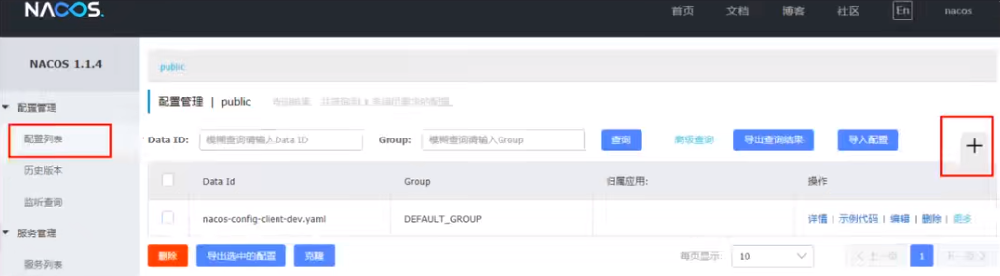
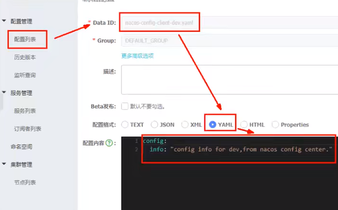
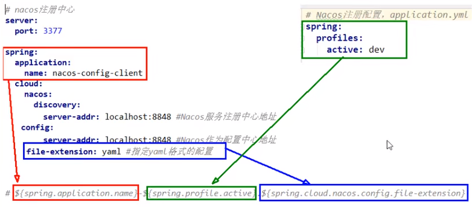

1. 创建Module，cloudalibaba-config-nacos-client3377

2. 编辑pom

   ```xml
   <?xml version="1.0" encoding="UTF-8"?>
   <project xmlns="http://maven.apache.org/POM/4.0.0"
            xmlns:xsi="http://www.w3.org/2001/XMLSchema-instance"
            xsi:schemaLocation="http://maven.apache.org/POM/4.0.0 http://maven.apache.org/xsd/maven-4.0.0.xsd">
       <parent>
           <artifactId>cloud2022</artifactId>
           <groupId>org.example</groupId>
           <version>1.0-SNAPSHOT</version>
       </parent>
       <modelVersion>4.0.0</modelVersion>
   
       <artifactId>cloudalibaba-config-nacos-client3377</artifactId>
       <dependencies>
           <!--nacos-config-->
           <dependency>
               <groupId>com.alibaba.cloud</groupId>
               <artifactId>spring-cloud-starter-alibaba-nacos-config</artifactId>
           </dependency>
           <!--nacos-discovery-->
           <dependency>
               <groupId>com.alibaba.cloud</groupId>
               <artifactId>spring-cloud-starter-alibaba-nacos-discovery</artifactId>
           </dependency>
           <!--web + actuator-->
           <dependency>
               <groupId>org.springframework.boot</groupId>
               <artifactId>spring-boot-starter-web</artifactId>
           </dependency>
           <dependency>
               <groupId>org.springframework.boot</groupId>
               <artifactId>spring-boot-starter-actuator</artifactId>
           </dependency>
           <!--一般基础配置-->
           <dependency>
               <groupId>org.springframework.boot</groupId>
               <artifactId>spring-boot-devtools</artifactId>
               <scope>runtime</scope>
               <optional>true</optional>
           </dependency>
           <dependency>
               <groupId>org.projectlombok</groupId>
               <artifactId>lombok</artifactId>
               <optional>true</optional>
           </dependency>
           <dependency>
               <groupId>org.springframework.boot</groupId>
               <artifactId>spring-boot-starter-test</artifactId>
               <scope>test</scope>
           </dependency>
       </dependencies>
   </project>
   ```

3. 添加bootstrap.yaml

   ```yaml
   # nacos配置
   server:
     port: 3377
   
   spring:
     application:
       name: nacos-config-client
     cloud:
       nacos:
         discovery:
           server-addr: localhost:8848 #Nacos服务注册中心地址
         config:
           server-addr: localhost:8848 #Nacos作为配置中心地址
           file-extension: yaml #指定yaml格式的配置
   
   
   # ${spring.application.name}-${spring.profile.active}.${spring.cloud.nacos.config.file-extension}
   # nacos-config-client-dev.yaml
   
   # nacos-config-client-test.yaml   ----> config.info
   ```

4. 添加application.yaml

   ```yaml
   spring:
     profiles:
       active: dev # 表示开发环境
   ```

5. 主启动类

   ```java
   import org.springframework.boot.SpringApplication;
   import org.springframework.boot.autoconfigure.SpringBootApplication;
   import org.springframework.cloud.client.discovery.EnableDiscoveryClient;
   
   @EnableDiscoveryClient
   @SpringBootApplication
   public class NacosConfigClientMain3377
   {
       public static void main(String[] args) {
           SpringApplication.run(NacosConfigClientMain3377.class, args);
       }
   }
   ```

6. 控制层

   ```java
   import org.springframework.beans.factory.annotation.Value;
   import org.springframework.cloud.context.config.annotation.RefreshScope;
   import org.springframework.web.bind.annotation.GetMapping;
   import org.springframework.web.bind.annotation.RestController;
   
   @RestController
   @RefreshScope //支持Nacos的动态刷新功能。
   public class ConfigClientController
   {
       @Value("${config.info}")
       private String configInfo;
   
       @GetMapping("/config/info")
       public String getConfigInfo() {
           return configInfo;
       }
   }
   ```

7. **在Nacos中添加配置信息**

   Nacos中的dataid的组成格式及与SpringBoot配置文件中的匹配规则

   [官方文档](https://nacos.io/zh-cn/docs/quick-start-spring-cloud.html)

   说明：之所以需要配置spring.application.name，是因为它是构成Nacos配置管理dataId 字段的一部分。

   在 Nacos Spring Cloud中,dataId的完整格式如下：

   ```yaml
   ${prefix}-${spring-profile.active}.${file-extension}
   ```

   

   * prefix默认为spring.application.name的值，也可以通过配置项spring.cloud.nacos.config.prefix来配置。
   * spring.profile.active即为当前环境对应的 profile，详情可以参考 Spring Boot文档。注意：当spring.profile.active为空时，对应的连接符 - 也将不存在，datald 的拼接格式变成${prefix}.${file-extension}
   * file-exetension为配置内容的数据格式，可以通过配置项spring .cloud.nacos.config.file-extension来配置。目前只支持properties和yaml类型。
   * 通过Spring Cloud 原生注解@RefreshScope实现配置自动更新。
     最后公式：

   ```yaml
   ${spring.application.name)}-${spring.profiles.active}.${spring.cloud.nacos.config.file-extension}
   ```

   配置新增

   

   Nacos界面配置对应 - 设置DataId

   

   配置小结

   

8. 测试

* 启动前需要在nacos客户端-配置管理-配置管理栏目下有对应的yaml配置文件
* 运行cloud-config-nacos-client3377的主启动类
* 调用接口查看配置信息 - http://localhost:3377/config/info

9. 自带动态刷新

   修改下Nacos中的yaml配置文件，再次调用查看配置的接口，就会发现配置已经刷新。
   