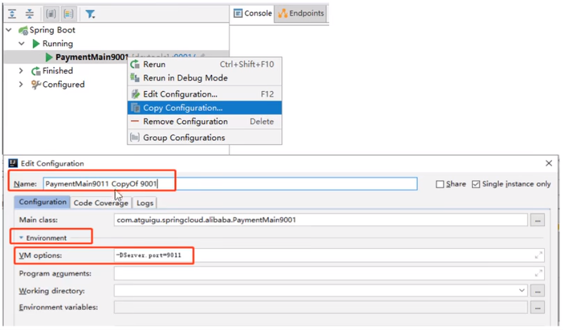

1. 新增Module - cloudalibaba-provider-payment9001

2. 父pom

   ```xml
   <dependencyManagement>
       <dependencies>
           <!--spring cloud alibaba 2.1.0.RELEASE-->
           <dependency>
               <groupId>com.alibaba.cloud</groupId>
               <artifactId>spring-cloud-alibaba-dependencies</artifactId>
               <version>2.1.0.RELEASE</version>
               <type>pom</type>
               <scope>import</scope>
           </dependency>
       </dependencies>
   </dependencyManagement>
   ```

3. 本模块POM

   ```xml
   <?xml version="1.0" encoding="UTF-8"?>
   <project xmlns="http://maven.apache.org/POM/4.0.0"
            xmlns:xsi="http://www.w3.org/2001/XMLSchema-instance"
            xsi:schemaLocation="http://maven.apache.org/POM/4.0.0 http://maven.apache.org/xsd/maven-4.0.0.xsd">
       <parent>
           <artifactId>cloud2022</artifactId>
           <groupId>org.example</groupId>
           <version>1.0-SNAPSHOT</version>
       </parent>
       <modelVersion>4.0.0</modelVersion>
   
       <artifactId>cloudalibaba-provider-payment9001</artifactId>
       <dependencies>
           <!--SpringCloud ailibaba nacos -->
           <dependency>
               <groupId>com.alibaba.cloud</groupId>
               <artifactId>spring-cloud-starter-alibaba-nacos-discovery</artifactId>
           </dependency>
           <!-- SpringBoot整合Web组件 -->
           <dependency>
               <groupId>org.springframework.boot</groupId>
               <artifactId>spring-boot-starter-web</artifactId>
           </dependency>
           <dependency>
               <groupId>org.springframework.boot</groupId>
               <artifactId>spring-boot-starter-actuator</artifactId>
           </dependency>
           <!--日常通用jar包配置-->
           <dependency>
               <groupId>org.springframework.boot</groupId>
               <artifactId>spring-boot-devtools</artifactId>
               <scope>runtime</scope>
               <optional>true</optional>
           </dependency>
           <dependency>
               <groupId>org.projectlombok</groupId>
               <artifactId>lombok</artifactId>
               <optional>true</optional>
           </dependency>
           <dependency>
               <groupId>org.springframework.boot</groupId>
               <artifactId>spring-boot-starter-test</artifactId>
               <scope>test</scope>
           </dependency>
       </dependencies>
   
   </project>
   ```

4. 增加yaml

   ```yaml
   server:
     port: 9001
   
   spring:
     application:
       name: nacos-payment-provider
     cloud:
       nacos:
         discovery:
           server-addr: localhost:8848 #配置Nacos地址
   
   management:
     endpoints:
       web:
         exposure:
           include: '*'
   ```

5. 主启动类

   ```java
   @EnableDiscoveryClient
   @SpringBootApplication
   public class PaymentMain9001 {
       public static void main(String[] args) {
           SpringApplication.run(PaymentMain9001.class, args);
       }
   }
   ```

6. 控制层

   ```java
   @RestController
   public class PaymentController {
       @Value("${server.port}")
       private String serverPort;
   
       @GetMapping(value = "/payment/nacos/{id}")
       public String getPayment(@PathVariable("id") Integer id) {
           return "nacos registry, serverPort: "+ serverPort+"\t id"+id;
       }
   }
   ```

7. 测试

   - http://localhost:9001/payment/nacos/1
   - nacos控制台
   - nacos服务注册中心+服务提供者9001都OK了

8. 为了下一章节演示nacos的负载均衡，参照9001新建9002

   - 新建cloudalibaba-provider-payment9002
   - 9002其它步骤你懂的
   - 或者**取巧**不想新建重复体力劳动，可以利用IDEA功能，直接拷贝虚拟端口映射

   

   

   