1. 环境规划

   预计需要，1个Nginx+3个[nacos](https://so.csdn.net/so/search?q=nacos&spm=1001.2101.3001.7020)注册中心+1个mysql

   > 请确保是在环境中安装使用:
   >
   > 1. 64 bit OS Linux/Unix/Mac，推荐使用Linux系统。
   > 2. 64 bit JDK 1.8+；[下载](http://www.oracle.com/technetwork/java/javase/downloads/jdk8-downloads-2133151.html).[配置](https://docs.oracle.com/cd/E19182-01/820-7851/inst_cli_jdk_javahome_t/)。
   > 3. Maven 3.2.x+；[下载](https://maven.apache.org/download.cgi).[配置](https://maven.apache.org/settings.html)。
   > 4. 3个或3个以上Nacos节点才能构成集群。
   >
   > [link](https://nacos.io/zh-cn/docs/cluster-mode-quick-start.html)

2. 下载

   Nacos下载Linux版

   - https://github.com/alibaba/nacos/releases/tag/1.1.4
   - nacos-server-1.1.4.tar.gz 解压后安装

3. **application.properties配置**

   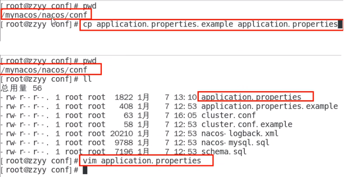

   添加以下内容，设置数据源

   ```properties
   spring.datasource.platform=mysql
   
   db.num=1
   db.url.0=jdbc:mysql://localhost:3306/nacos_devtest?characterEncoding=utf8&connectTimeout=1000&socketTimeout=3000&autoReconnect=true
   db.user=root
   db.password=1234
   ```

4. **Linux服务器上nacos的集群配置cluster.conf**

   梳理出3台nacos集器的不同服务端口号，设置3个端口：

   - 3333
   - 4444
   - 5555

   复制出cluster.conf

   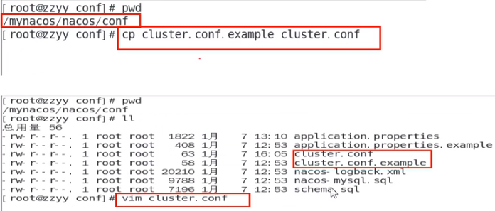

   内容

   ```sh
   192.168.111.144:3333
   192.168.111.144:4444
   192.168.111.144:5555
   ```

   **注意**，这个IP不能写127.0.0.1，必须是Linux命令`hostname -i`能够识别的IP

   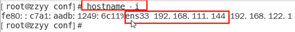

5. **编辑Nacos的启动脚本startup.sh，使它能够接受不同的启动端口**

   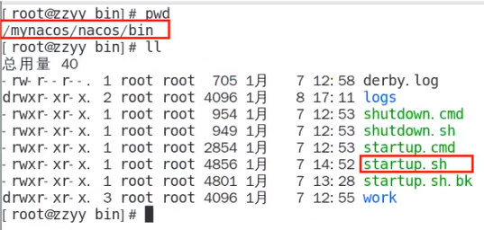

平时单机版的启动，都是./startup.sh即可

但是，集群启动，我们希望可以类似其它软件的shell命令，传递不同的端口号启动不同的nacos实例。
命令: ./startup.sh -p 3333表示启动端口号为3333的nacos服务器实例，和上一步的cluster.conf配置的一致。

修改内容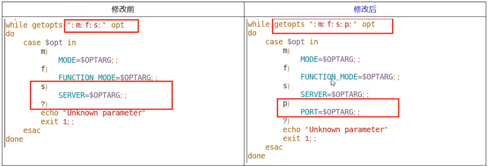

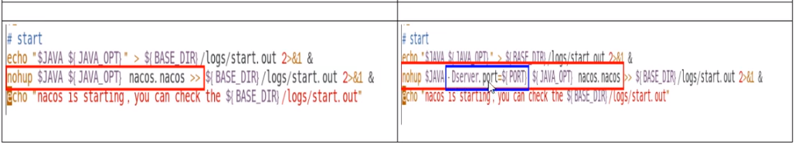

执行方式 - `startup.sh - p 端口号`

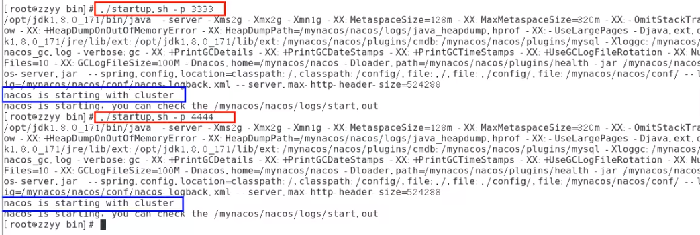

6. **Nginx的配置，由它作为负载均衡器**

   修改nginx的配置文件 - nginx.conf

   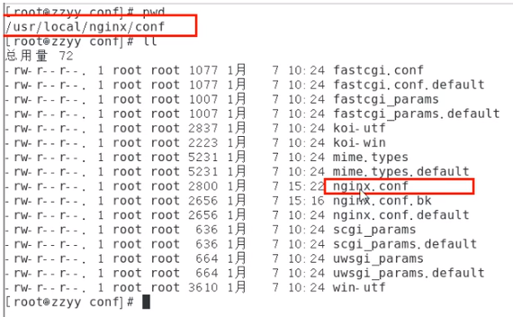

   修改内容

   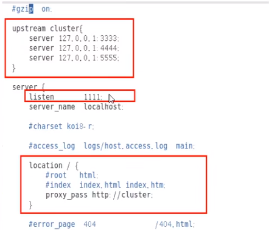

   按照指定启动

   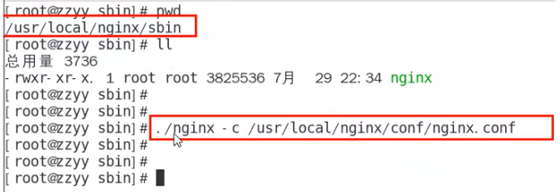

   7. 截止到此处，1个Nginx+3个nacos注册中心+1个mysql

      测试

      启动3个nacos注册中心

      * startup.sh - p 3333

      * startup.sh - p 4444

      * startup.sh - p 5555

      查看nacos进程启动数

      ```sh
      ps -ef | grep nacos | grep -v grep | wc -l
      ```

      启动nginx

      ```sh
      ./nginx -c /usr/local/nginx/conf/nginx.conf
      ```

      查看nginx进程ps - ef| grep nginx
      测试通过nginx，访问nacos - http://192.168.111.144:1111/nacos/#/login

      新建一个配置测试

      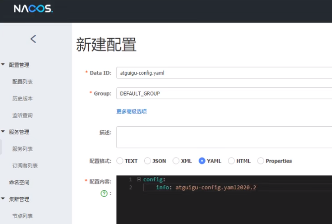

      - 新建后，可在linux服务器的mysql新插入一条记录

      ```sql
      select * from config;
      ```

      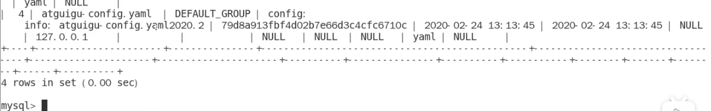

      * 让微服务cloudalibaba-provider-payment9002启动注册进nacos集群 - 修改配置文件

        ```yaml
        server:
          port: 9002
        
        spring:
          application:
            name: nacos-payment-provider
          cloud:
            nacos:
              discovery:
                #配置Nacos地址
                #server-addr: Localhost:8848
                #换成nginx的1111端口，做集群
                server-addr: 192.168.111.144:1111
        
        management:
          endpoints:
            web:
              exposure:
                inc1ude: '*'
        
        ```

      * 启动微服务cloudalibaba-provider-payment9002

      * 访问nacos，查看注册结果

        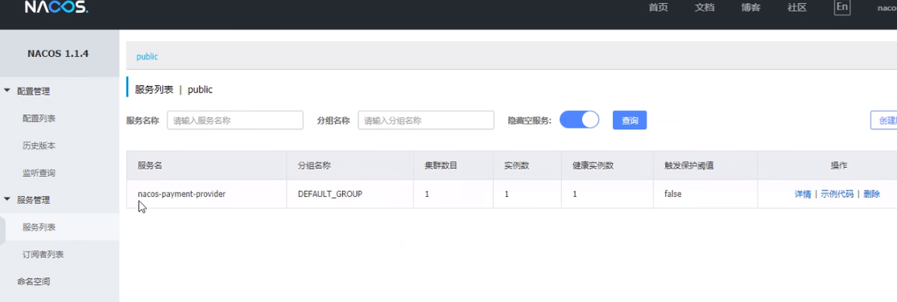

      ## **高可用小总结**

      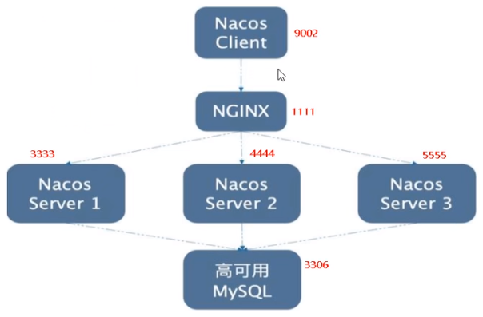

      

      

   

   