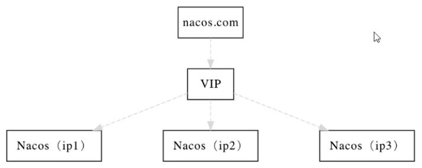
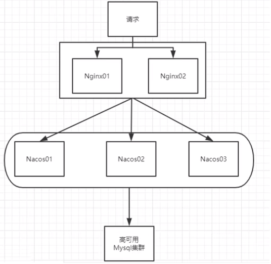

[官方文档](https://nacos.io/zh-cn/docs/cluster-mode-quick-start.html)

> 官网架构图
>
> 集群部署架构图
>
> 因此开源的时候推荐用户把所有服务列表放到一个vip下面，然后挂到一个域名下面
>
> http://ip1:port/openAPI直连ip模式，机器挂则需要修改ip才可以使用。
>
> http://VIP:port/openAPI挂载VIP模式，直连vip即可，下面挂server真实ip，可读性不好。
>
> http://nacos.com:port/openAPI域名＋VIP模式，可读性好，而且换ip方便，推荐模式
>
> 

上图官网翻译，真实情况



按照上述，**我们需要mysql数据库**。

> [官网说明](https://nacos.io/zh-cn/docs/deployment.html)
>
> 默认Nacos使用嵌入式数据库实现数据的存储。所以，如果启动多个默认配置下的Nacos节点，数据存储是存在一致性问题的。为了解决这个问题，Nacos采用了集中式存储的方式来支持集群化部署，目前只支持MySQL的存储。
>
> Nacos支持三种部署模式
>
> * 单机模式-用于测试和单机试用。
> * 集群模式-用于生产环境，确保高可用。
> * 多集群模式-用于多数据中心场景。
>
> **Windows**
>
> cmd startup.cmd或者双击startup.cmd文件
>
> **单机模式支持mysql**
>
> 在0.7版本之前，在单机模式时nacos使用嵌入式数据库实现数据的存储，不方便观察数据存储的基本情况。0.7版本增加了支持mysql数据源能力，具体的操作步骤:
>
> 1. 安装数据库，版本要求:5.6.5+
> 2. 初始化mysq数据库，数据库初始化文件: nacos-mysql.sql
> 3. 修改conf/application.properties文件，增加支持mysql数据源配置（目前只支持mysql)，添加mysql数据源的url、用户名和密码。
>
> ```sql
> spring.datasource.platform=mysql
> 
> db.num=1
> db.url.0=jdbc:mysql://11.162.196.16:3306/nacos_devtest?characterEncoding=utf8&connectTimeout=1000&socketTimeout=3000&autoReconnect=true
> db.user=nacos_devtest
> db.password=youdontknow
> ```
>
> 再以单机模式启动nacos，nacos所有写嵌入式数据库的数据都写到了mysql。

