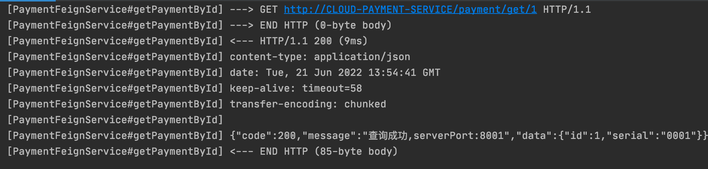

1. feign配置类

   ```java
   @Configuration
   public class FeignConfig {
       @Bean
       Logger.Level feignLoggerLevel()
       {
           return Logger.Level.FULL;
       }
   }
   ```

2. yaml配置

   ```yaml
   logging:
     level:
       # feign日志以什么级别监控哪个接口
       com.example.cloud.service.PaymentFeignService: debug
   ```

3. 日志效果

   

   