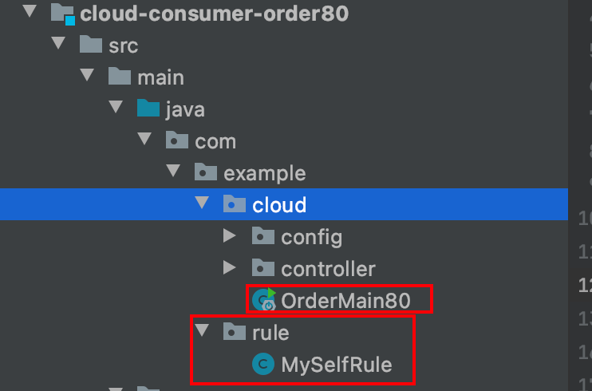
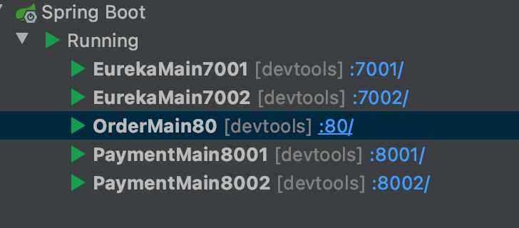

官方文档明确给出了警告:

这个自定义配置类不能放在@ComponentScan所扫描的当前包下以及子包下，

否则我们自定义的这个配置类就会被所有的Ribbon客户端所共享，达不到特殊化定制的目的了。

（**也就是说不要将Ribbon配置类与主启动类同包**）



* 在com.lun.myrule下新建MySelfRule规则类

  ```java
  import com.netflix.loadbalancer.IRule;
  import com.netflix.loadbalancer.RandomRule;
  import org.springframework.context.annotation.Bean;
  import org.springframework.context.annotation.Configuration;
  
  @Configuration
  public class MySelfRule {
  
      @Bean
      public IRule myRule(){
          return new RandomRule();//默认规则为“轮询”，这里将规则切换成“随机”
      }
  }
  ```

* 主启动类添加@RibbonClient

  ```java
  import com.lun.myrule.MySelfRule;
  import org.springframework.boot.SpringApplication;
  import org.springframework.boot.autoconfigure.SpringBootApplication;
  import org.springframework.cloud.netflix.eureka.EnableEurekaClient;
  import org.springframework.cloud.netflix.ribbon.RibbonClient;
  
  @SpringBootApplication
  @EnableEurekaClient
  //添加到此处
  @RibbonClient(name = "CLOUD-PAYMENT-SERVICE", configuration = MySelfRule.class)
  public class OrderMain80
  {
      public static void main( String[] args ){
          SpringApplication.run(OrderMain80.class, args);
      }
  }
  ```

* 重启80服务（订单服务）

  