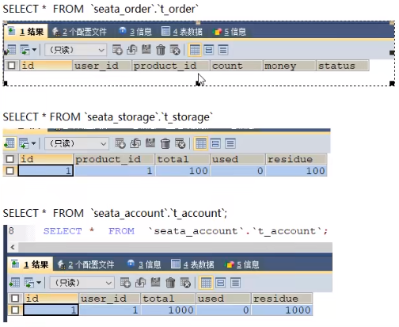
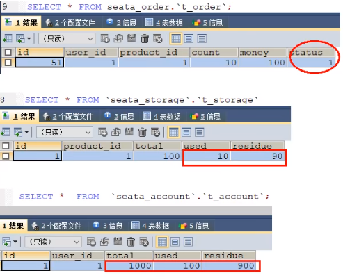
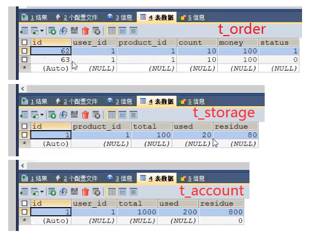

## Seata之@GlobalTransactional验证

下订单 -> 减库存 -> 扣余额 -> 改（订单）状态

数据库初始情况：



正常下单 - http://localhost:2001/order/create?userId=1&productId=1&count=10&money=100

数据库正常下单后状况：



------

**超时异常，没加@GlobalTransactional**

模拟AccountServiceImpl添加超时

```java
@Service
public class AccountServiceImpl implements AccountService {

    private static final Logger LOGGER = LoggerFactory.getLogger(AccountServiceImpl.class);


    @Resource
    AccountDao accountDao;

    /**
     * 扣减账户余额
     */
    @Override
    public void decrease(Long userId, BigDecimal money) {
        LOGGER.info("------->account-service中扣减账户余额开始");
        //模拟超时异常，全局事务回滚
        //暂停几秒钟线程
        try { TimeUnit.SECONDS.sleep(20); } catch (InterruptedException e) { e.printStackTrace(); }
        accountDao.decrease(userId,money);
        LOGGER.info("------->account-service中扣减账户余额结束");
    }
}
12345678910111213141516171819202122
```

另外，OpenFeign的调用默认时间是1s以内，所以最后会抛异常。

数据库情况



**故障情况**

- 当库存和账户金额扣减后，订单状态并没有设置为已经完成，没有从零改为1
- 而且由于feign的重试机制，账户余额还有可能被多次扣减

------

**超时异常，加了@GlobalTransactional**

用@GlobalTransactional标注OrderServiceImpl的create()方法。

```java
@Service
@Slf4j
public class OrderServiceImpl implements OrderService {
    
    ...

    /**
     * 创建订单->调用库存服务扣减库存->调用账户服务扣减账户余额->修改订单状态
     * 简单说：下订单->扣库存->减余额->改状态
     */
    @Override
    //rollbackFor = Exception.class表示对任意异常都进行回滚
    @GlobalTransactional(name = "fsp-create-order",rollbackFor = Exception.class)
    public void create(Order order)
    {
		...
    }
}
123456789101112131415161718
```

还是模拟AccountServiceImpl添加超时，下单后数据库数据并没有任何改变，记录都添加不进来，**达到出异常，数据库回滚的效果**。