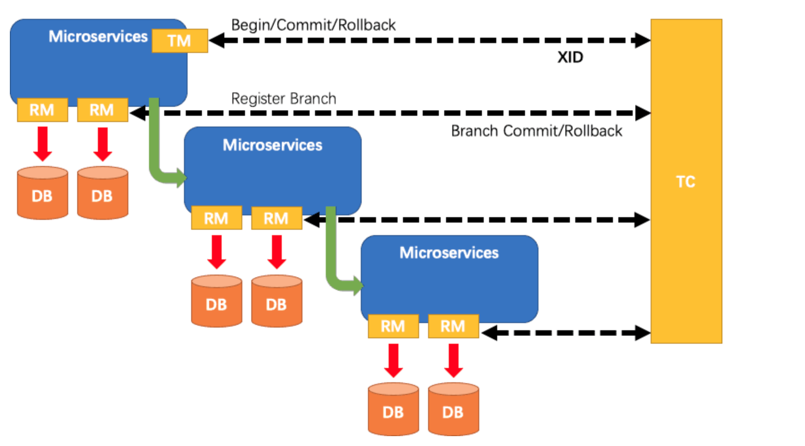
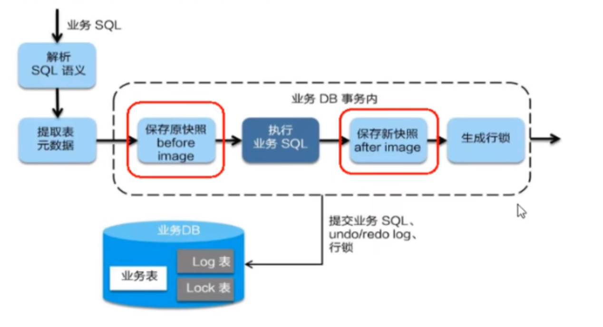

## Seata之原理简介

2019年1月份蚂蚁金服和阿里巴巴共同开源的分布式事务解决方案。

Simple Extensible Autonomous Transaction Architecture，简单可扩展自治事务框架。

2020起始，用1.0以后的版本。Alina Gingertail

**分布式事务的执行流程**

- TM开启分布式事务(TM向TC注册全局事务记录) ;
- 按业务场景，编排数据库、服务等事务内资源(RM向TC汇报资源准备状态) ;
- TM结束分布式事务，事务一阶段结束(TM通知TC提交/回滚分布式事务) ;
- TC汇总事务信息，决定分布式事务是提交还是回滚；
- TC通知所有RM提交/回滚资源，事务二阶段结束。

**AT模式如何做到对业务的无侵入**

- 是什么

> **前提**
>
> - 基于支持本地 ACID 事务的关系型数据库。
> - Java 应用，通过 JDBC 访问数据库。
>
> **整体机制**
>
> 两阶段提交协议的演变：
>
> - 一阶段：业务数据和回滚日志记录在同一个本地事务中提交，释放本地锁和连接资源。
> - 二阶段：
>   - 提交异步化，非常快速地完成。
>   - 回滚通过一阶段的回滚日志进行反向补偿。
>
> [link](http://seata.io/zh-cn/docs/overview/what-is-seata.html)

- 一阶段加载

在一阶段，Seata会拦截“业务SQL”

1. 解析SQL语义，找到“业务SQL" 要更新的业务数据，在业务数据被更新前，将其保存成"before image”
2. 执行“业务SQL" 更新业务数据，在业务数据更新之后,
3. 其保存成"after image”，最后生成行锁。

以上操作全部在一个数据库事务内完成, 这样保证了一阶段操作的原子性。

- 二阶段提交

二阶段如果顺利提交的话，因为"业务SQL"在一阶段已经提交至数据库，所以Seata框架只需将一阶段保存的快照数据和行锁删掉，完成数据清理即可。

- 二阶段回滚

二阶段如果是回滚的话，Seata 就需要回滚一阶段已经执行的 “业务SQL"，还原业务数据。

回滚方式便是用"before image"还原业务数据；但在还原前要首先要校验脏写，对比“数据库当前业务数据”和"after image"。

如果两份数据完全一致就说明没有脏写， 可以还原业务数据，如果不一致就说明有脏写, 出现脏写就需要转人工处理。

补充

