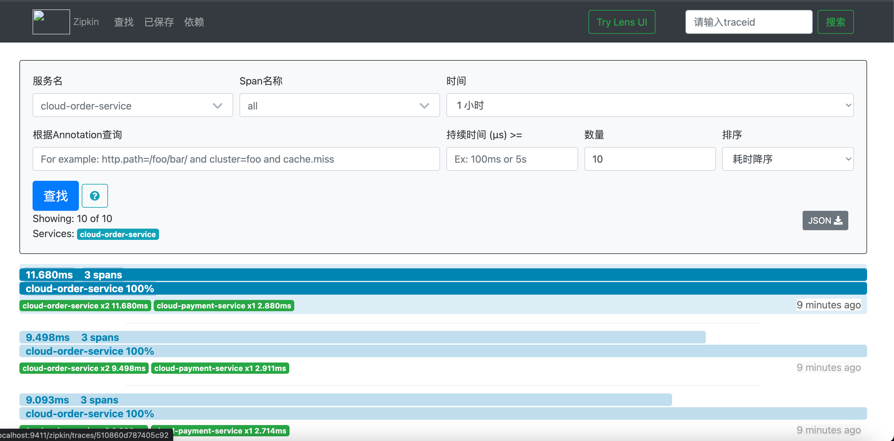
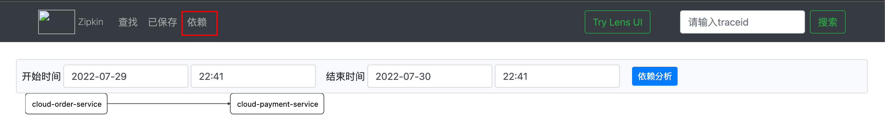
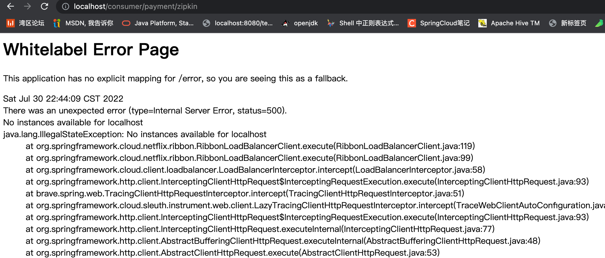

1. 修改cloud-provider-payment8001的pom

   ```xml
   <!--包含了sleuth+zipkin-->
   <dependency>
       <groupId>org.springframework.cloud</groupId>
       <artifactId>spring-cloud-starter-zipkin</artifactId>
   </dependency>
   ```

2. 修改yaml

   ```yaml
   spring:
     application:
       name: cloud-payment-service
     zipkin: #<-------------------------------------关键
       base-url: http://localhost:9411
     sleuth: #<-------------------------------------关键
       sampler:
       #采样率值介于 0 到 1 之间，1 则表示全部采集
       probability: 1
     datasource:
       type: com.alibaba.druid.pool.DruidDataSource            # 当前数据源操作类型
       driver-class-name: org.gjt.mm.mysql.Driver              # mysql驱动包
       url: jdbc:mysql://localhost:3306/cloud?useUnicode=true&characterEncoding=utf-8&useSSL=false
       username: root
       password: 1
   ```

3. 控制层

   ```java
   @GetMapping("/payment/zipkin")
   public String paymentZipkin() {
       return "hi ,i'am paymentzipkin server fall back，welcome to here, O(∩_∩)O哈哈~";
   }
   ```

4. 修改cloue-consumer-order80的pom

   ```xml
   <dependency>
       <groupId>org.springframework.cloud</groupId>
       <artifactId>spring-cloud-starter-zipkin</artifactId>
   </dependency>
   ```

5. yaml

   ```yaml
   spring:
       application:
           name: cloud-order-service
       zipkin:
         base-url: http://localhost:9411
       sleuth:
         sampler:
           probability: 1
   ```

6. 控制层

   ```java
       // ====================> zipkin+sleuth
       @GetMapping("/consumer/payment/zipkin")
       public String paymentZipkin()
       {
           String result = restTemplate.getForObject("http://localhost:8001"+"/payment/zipkin/", String.class);
           return result;
       }
   ```

7. 依次启动eureka7001/8001/80 - 80调用8001几次测试下

8. 效果

   

   

9. 踩坑

   

   * 如果出现**No instances available for localhost**问题，是由于`RestTemplate`配置了负载均衡造成，需要去掉`ApplicationContextConfig`中的`@LoadBalanced`注解

     ```java
     @Configuration
     public class ApplicationContextConfig {
     
         @Bean
     //    @LoadBalanced
         public RestTemplate getRestTemplate(){
             return new RestTemplate();
         }
     
     }
     ```