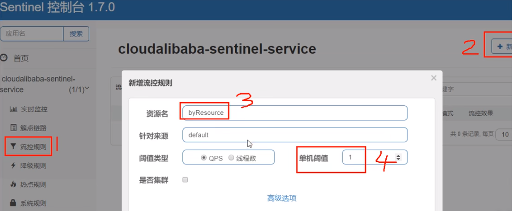
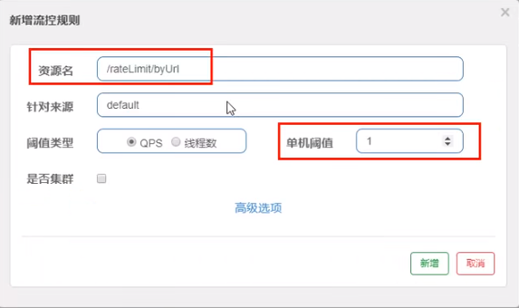
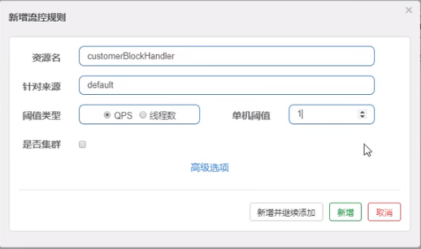

# SentinelResource配置

## *按资源名称限流 + 后续处理*

**启动Nacos成功**

**启动Sentinel成功**

**Module - cloudalibaba-sentinel-service8401**

```java
import com.alibaba.csp.sentinel.annotation.SentinelResource;
import com.alibaba.csp.sentinel.slots.block.BlockException;
import com.atguigu.springcloud.alibaba.myhandler.CustomerBlockHandler;
import com.atguigu.springcloud.entities.CommonResult;
import com.atguigu.springcloud.entities.Payment;
import org.springframework.web.bind.annotation.GetMapping;
import org.springframework.web.bind.annotation.RestController;

@RestController
public class RateLimitController {
    
    @GetMapping("/byResource")
    @SentinelResource(value = "byResource",blockHandler = "handleException")
    public CommonResult byResource() {
        return new CommonResult(200,"按资源名称限流测试OK",new Payment(2020L,"serial001"));
    }
    
    public CommonResult handleException(BlockException exception) {
        return new CommonResult(444,exception.getClass().getCanonicalName()+"\t 服务不可用");
    }
}
```

**配置流控规则**

配置步骤



图形配置和代码关系

表示1秒钟内查询次数大于1，就跑到我们自定义的处流，限流

**测试**

1秒钟点击1下，OK

超过上述，疯狂点击，返回了自己定义的限流处理信息，限流发生

```json
{"code":444, "message":"com.alibaba.csp.sentinel.slots.block.flow.FlowException\t 服务不可用", "data":null}
```

## *按照Url地址限流 + 后续处理*

**通过访问的URL来限流，会返回Sentinel自带默认的限流处理信息**

**业务类RateLimitController**

```java
@RestController
public class RateLimitController
{
	...

    @GetMapping("/rateLimit/byUrl")
    @SentinelResource(value = "byUrl")
    public CommonResult byUrl()
    {
        return new CommonResult(200,"按url限流测试OK",new Payment(2020L,"serial002"));
    }
}
```

**Sentinel控制台配置**



测试

* 快速点击http://localhost:8401/rateLimit/byUrl
* 结果 - 会返回Sentinel自带的限流处理结果 Blocked by Sentinel (flow limiting)

上面兜底方案面临的问题

* 系统默认的，没有体现我们自己的业务要求。
* 依照现有条件，我们自定义的处理方法又和业务代码耦合在一块，不直观。
* 每个业务方法都添加—个兜底的，那代码膨胀加剧。
* 全局统—的处理方法没有体现。

## 避免业务代码与降级方法耦合

客户自定义限流处理逻辑

自定义限流处理类 - 创建CustomerBlockHandler类用于自定义限流处理逻辑

```java
import com.alibaba.csp.sentinel.slots.block.BlockException;
import com.atguigu.springcloud.entities.CommonResult;
import com.atguigu.springcloud.entities.Payment;

public class CustomerBlockHandler {
    public static CommonResult handlerException(BlockException exception) {
        return new CommonResult(4444,"按客戶自定义,global handlerException----1");
    }
    
    public static CommonResult handlerException2(BlockException exception) {
        return new CommonResult(4444,"按客戶自定义,global handlerException----2");
    }
}
```

RateLimitController

```java
@RestController
public class RateLimitController {
	...

    @GetMapping("/rateLimit/customerBlockHandler")
    @SentinelResource(value = "customerBlockHandler",
            blockHandlerClass = CustomerBlockHandler.class,//<-------- 自定义限流处理类
            blockHandler = "handlerException2")//<-----------
    public CommonResult customerBlockHandler()
    {
        return new CommonResult(200,"按客戶自定义",new Payment(2020L,"serial003"));
    }
}

```

Sentinel控制台配置



启动微服务后先调用一次 - http://localhost:8401/rateLimit/customerBlockHandler。然后，多次快速刷新http://localhost:8401/rateLimit/customerBlockHandler。刷新后，我们自定义兜底方法的字符串信息就返回到前端。

## Sentinel注解参数介绍

> **@SentinelResource 注解**
>
> > 注意：注解方式埋点不支持 private 方法。
>
> `@SentinelResource` 用于定义资源，并提供可选的异常处理和 fallback 配置项。 `@SentinelResource` 注解包含以下属性：
>
> - `value`：资源名称，必需项（不能为空）
> - `entryType`：entry 类型，可选项（默认为 `EntryType.OUT`）
> - `blockHandler` / `blockHandlerClass`: `blockHandler` 对应处理 `BlockException` 的函数名称，可选项。blockHandler 函数访问范围需要是 `public`，返回类型需要与原方法相匹配，参数类型需要和原方法相匹配并且最后加一个额外的参数，类型为 `BlockException`。blockHandler 函数默认需要和原方法在同一个类中。若希望使用其他类的函数，则可以指定 `blockHandlerClass` 为对应的类的 `Class` 对象，注意对应的函数必需为 static 函数，否则无法解析。
> - fallback/fallbackClass：fallback 函数名称，可选项，用于在抛出异常的时候提供 fallback 处理逻辑。fallback 函数可以针对所有类型的异常（除了`exceptionsToIgnore`里面排除掉的异常类型）进行处理。fallback 函数签名和位置要求：
>   - 返回值类型必须与原函数返回值类型一致；
>   - 方法参数列表需要和原函数一致，或者可以额外多一个 `Throwable` 类型的参数用于接收对应的异常。
>   - fallback 函数默认需要和原方法在同一个类中。若希望使用其他类的函数，则可以指定 `fallbackClass` 为对应的类的 `Class` 对象，注意对应的函数必需为 static 函数，否则无法解析。
> - defaultFallback（since 1.6.0）：默认的 fallback 函数名称，可选项，通常用于通用的 fallback 逻辑（即可以用于很多服务或方法）。默认 fallback 函数可以针对所有类型的异常（除了exceptionsToIgnore里面排除掉的异常类型）进行处理。若同时配置了 fallback 和 defaultFallback，则只有 fallback 会生效。defaultFallback 函数签名要求：
>   - 返回值类型必须与原函数返回值类型一致；
>   - 方法参数列表需要为空，或者可以额外多一个 `Throwable` 类型的参数用于接收对应的异常。
>   - defaultFallback 函数默认需要和原方法在同一个类中。若希望使用其他类的函数，则可以指定 `fallbackClass` 为对应的类的 `Class` 对象，注意对应的函数必需为 static 函数，否则无法解析。
> - `exceptionsToIgnore`（since 1.6.0）：用于指定哪些异常被排除掉，不会计入异常统计中，也不会进入 fallback 逻辑中，而是会原样抛出。
>
> [link](https://github.com/alibaba/Sentinel/wiki/注解支持#sentinelresource-注解)

## Sentinel主要有三个核心Api：

1. SphU定义资源
2. Tracer定义统计
3. ContextUtil定义了上下文


