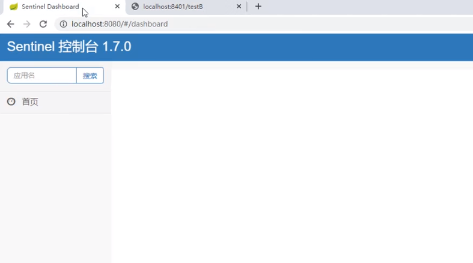
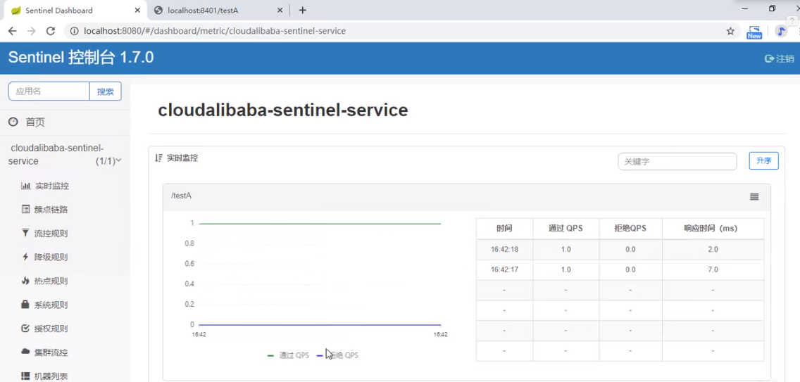

1. **启动Nacos8848成功**

2. **新建工程 - cloudalibaba-sentinel-service8401**

3. 修改pom

   ```xml
   <?xml version="1.0" encoding="UTF-8"?>
   <project xmlns="http://maven.apache.org/POM/4.0.0"
            xmlns:xsi="http://www.w3.org/2001/XMLSchema-instance"
            xsi:schemaLocation="http://maven.apache.org/POM/4.0.0 http://maven.apache.org/xsd/maven-4.0.0.xsd">
       <parent>
           <artifactId>cloud2022</artifactId>
           <groupId>org.example</groupId>
           <version>1.0-SNAPSHOT</version>
       </parent>
       <modelVersion>4.0.0</modelVersion>
   
       <artifactId>cloudalibaba-sentinel-service8401</artifactId>
   
       <dependencies>
           <dependency><!-- 引入自己定义的api通用包，可以使用Payment支付Entity -->
               <groupId>org.example</groupId>
               <artifactId>cloud-api-commons</artifactId>
               <version>1.0-SNAPSHOT</version>
           </dependency>
           <!--SpringCloud ailibaba nacos -->
           <dependency>
               <groupId>com.alibaba.cloud</groupId>
               <artifactId>spring-cloud-starter-alibaba-nacos-discovery</artifactId>
           </dependency>
           <!--SpringCloud ailibaba sentinel-datasource-nacos 后续做持久化用到-->
           <dependency>
               <groupId>com.alibaba.csp</groupId>
               <artifactId>sentinel-datasource-nacos</artifactId>
           </dependency>
           <!--SpringCloud ailibaba sentinel -->
           <dependency>
               <groupId>com.alibaba.cloud</groupId>
               <artifactId>spring-cloud-starter-alibaba-sentinel</artifactId>
           </dependency>
           <!--openfeign-->
           <dependency>
               <groupId>org.springframework.cloud</groupId>
               <artifactId>spring-cloud-starter-openfeign</artifactId>
           </dependency>
           <!-- SpringBoot整合Web组件+actuator -->
           <dependency>
               <groupId>org.springframework.boot</groupId>
               <artifactId>spring-boot-starter-web</artifactId>
           </dependency>
           <dependency>
               <groupId>org.springframework.boot</groupId>
               <artifactId>spring-boot-starter-actuator</artifactId>
           </dependency>
           <!--日常通用jar包配置-->
           <dependency>
               <groupId>org.springframework.boot</groupId>
               <artifactId>spring-boot-devtools</artifactId>
               <scope>runtime</scope>
               <optional>true</optional>
           </dependency>
           <dependency>
               <groupId>cn.hutool</groupId>
               <artifactId>hutool-all</artifactId>
               <version>4.6.3</version>
           </dependency>
           <dependency>
               <groupId>org.projectlombok</groupId>
               <artifactId>lombok</artifactId>
               <optional>true</optional>
           </dependency>
           <dependency>
               <groupId>org.springframework.boot</groupId>
               <artifactId>spring-boot-starter-test</artifactId>
               <scope>test</scope>
           </dependency>
   
       </dependencies>
   </project>
   ```

4. 修改yaml

   ```yaml
   server:
     port: 8401
   
   spring:
     application:
       name: cloudalibaba-sentinel-service
     cloud:
       nacos:
         discovery:
           server-addr: localhost:8848 #Nacos服务注册中心地址
       sentinel:
         transport:
           dashboard: localhost:8080 #配置Sentinel dashboard地址
           port: 8719
   
   management:
     endpoints:
       web:
         exposure:
           include: '*'
   
   feign:
     sentinel:
       enabled: true # 激活Sentinel对Feign的支持
   ```

5. 主启动类

   ```java
   @EnableDiscoveryClient
   @SpringBootApplication
   public class MainApp8401 {
       public static void main(String[] args) {
           SpringApplication.run(MainApp8401.class, args);
       }
   }
   ```

6. 控制层

   ```java
   @RestController
   @Slf4j
   public class FlowLimitController {
       @GetMapping("/testA")
       public String testA()
       {
           return "------testA";
       }
   
       @GetMapping("/testB")
       public String testB()
       {
           log.info(Thread.currentThread().getName()+"\t"+"...testB");
           return "------testB";
       }
   }
   ```

7. **启动Sentinel8080 - `java -jar sentinel-dashboard-1.7.0.jar`**

8. **启动微服务8401**

9. **启动8401微服务后查看sentienl控制台**

   - 刚启动，空空如也，啥都没有

     

   - Sentinel采用的懒加载说明

     - 执行一次访问即可
       - http://localhost:8401/testA
       - http://localhost:8401/testB
     - 效果 - sentinel8080正在监控微服务8401

     