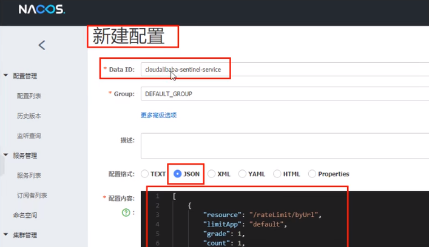
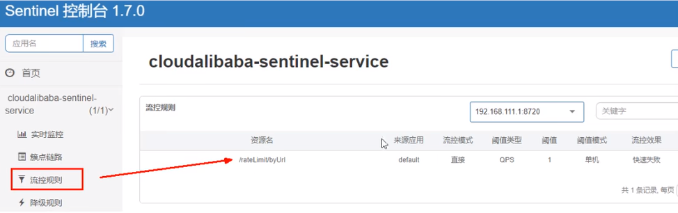
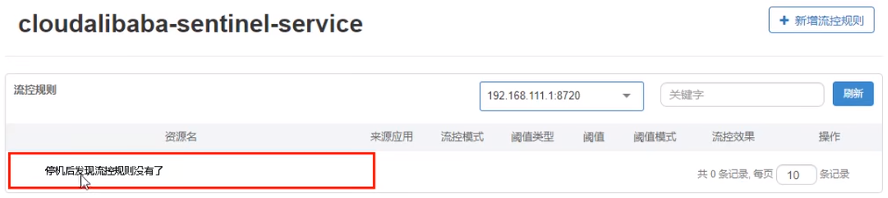

## Sentinel持久化规则

**是什么**

一旦我们重启应用，sentinel规则将消失，生产环境需要将配置规则进行持久化。

**怎么玩**

将限流配置规则持久化进Nacos保存，只要刷新8401某个rest地址，sentinel控制台的流控规则就能看到，只要Nacos里面的配置不删除，针对8401上sentinel上的流控规则持续有效。

**步骤**

修改cloudalibaba-sentinel-service8401

POM

```xml
<!--SpringCloud ailibaba sentinel-datasource-nacos 后续做持久化用到-->
<dependency>
    <groupId>com.alibaba.csp</groupId>
    <artifactId>sentinel-datasource-nacos</artifactId>
</dependency>
12345
```

YML

```yaml
server:
  port: 8401

spring:
  application:
    name: cloudalibaba-sentinel-service
  cloud:
    nacos:
      discovery:
        server-addr: localhost:8848 #Nacos服务注册中心地址
    sentinel:
      transport:
        dashboard: localhost:8080 #配置Sentinel dashboard地址
        port: 8719
      datasource: #<---------------------------关注点，添加Nacos数据源配置
        ds1:
          nacos:
            server-addr: localhost:8848
            dataId: cloudalibaba-sentinel-service
            groupId: DEFAULT_GROUP
            data-type: json
            rule-type: flow

management:
  endpoints:
    web:
      exposure:
        include: '*'

feign:
  sentinel:
    enabled: true # 激活Sentinel对Feign的支持
1234567891011121314151617181920212223242526272829303132
```

添加Nacos业务规则配置



配置内容解析

```json
[{
    "resource": "/rateLimit/byUrl",
    "IimitApp": "default",
    "grade": 1,
    "count": 1, 
    "strategy": 0,
    "controlBehavior": 0,
    "clusterMode": false
}]
123456789
```

- resource：资源名称；
- limitApp：来源应用；
- grade：阈值类型，0表示线程数, 1表示QPS；
- count：单机阈值；
- strategy：流控模式，0表示直接，1表示关联，2表示链路；
- controlBehavior：流控效果，0表示快速失败，1表示Warm Up，2表示排队等待；
- clusterMode：是否集群。

启动8401后刷新sentinel发现业务规则有了



快速访问测试接口 - http://localhost:8401/rateLimit/byUrl - 页面返回`Blocked by Sentinel (flow limiting)`

停止8401再看sentinel - 停机后发现流控规则没有了



重新启动8401再看sentinel

- 乍一看还是没有，稍等一会儿
- 多次调用 - http://localhost:8401/rateLimit/byUrl
- 重新配置出现了，持久化验证通过