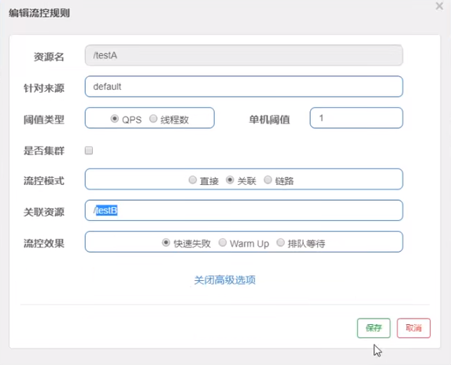
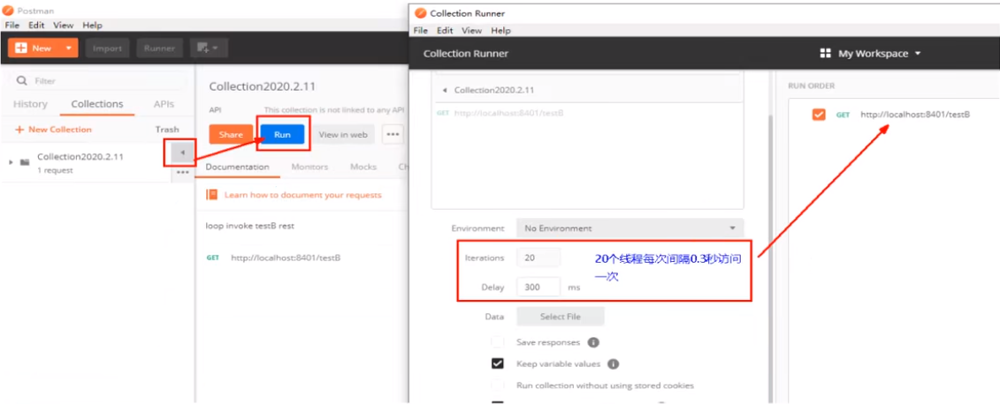
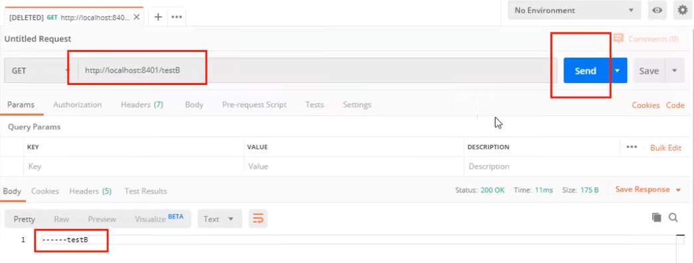
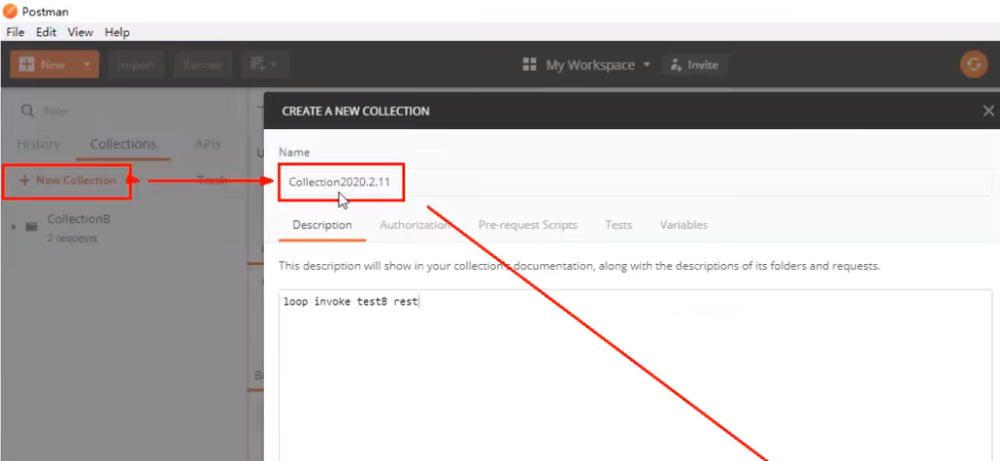
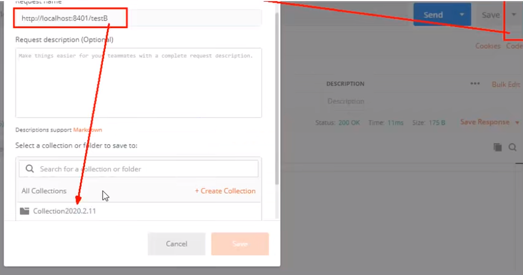

**是什么？**

- 当自己关联的资源达到阈值时，就限流自己
- 当与A关联的资源B达到阀值后，就限流A自己（B惹事，A挂了）

**设置testA**

当关联资源/testB的QPS阀值超过1时，就限流/testA的Rest访问地址，**当关联资源到阈值后限制配置好的资源名**。

**Postman模拟并发密集访问testB**

访问testB成功

postman里新建多线程集合组

将访问地址添加进新新线程组

Run - 大批量线程高并发访问B

Postman运行后，点击访问http://localhost:8401/testA，发现testA挂了

* 结果Blocked by Sentinel(flow limiting)

HOMEWORK：

自己上机测试

链路：只记录指定链路上的流量（指定资源从入口资源进来的流量，如果达到阈值，就进行限流)【API级别的针对来源】

[链路在github上issue](https://github.com/alibaba/Sentinel/issues/1213)

