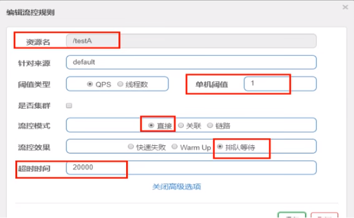
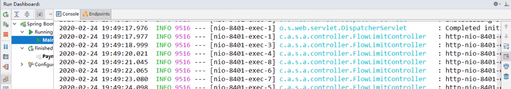

## Sentinel流控-排队等待

匀速排队，让请求以均匀的速度通过，阀值类型必须设成QPS，否则无效。

设置：/testA每秒1次请求，超过的话就排队等待，等待的超时时间为20000毫秒。



> 匀速排队
>
> 匀速排队（RuleConstant.CONTROL_BEHAVIOR_RATE_LIMITER）方式会严格控制请求通过的间隔时间，也即是让请求以均匀的速度通过，对应的是漏桶算法。详细文档可以参考 流量控制 - 匀速器模式，具体的例子可以参见 PaceFlowDemo。
>
> 该方式的作用如下图所示：
>
> 
>
> 这种方式主要用于处理间隔性突发的流量，例如消息队列。想象一下这样的场景，在某一秒有大量的请求到来，而接下来的几秒则处于空闲状态，我们希望系统能够在接下来的空闲期间逐渐处理这些请求，而不是在第一秒直接拒绝多余的请求。
>
> 注意：匀速排队模式暂时不支持 QPS > 1000 的场景。
>
> [link](https://github.com/alibaba/Sentinel/wiki/流量控制#匀速排队)

源码 - com.alibaba.csp.sentinel.slots.block.flow.controller.RateLimiterController

**测试**

- 添加日志记录代码到FlowLimitController的testA方法

```java
@RestController
@Slf4j
public class FlowLimitController {
    @GetMapping("/testA")
    public String testA()
    {
        log.info(Thread.currentThread().getName()+"\t"+"...testA");//<----
        return "------testA";
    }

    ...
}
```

- Postman模拟并发密集访问testA。具体操作参考[117_Sentinel流控-关联](https://blog.csdn.net/u011863024/article/details/114298288#)
- 后台结果

