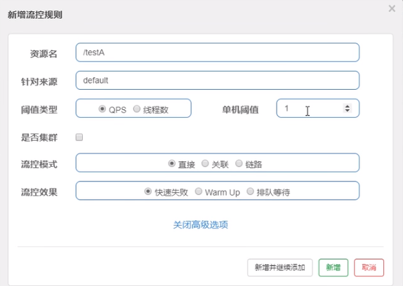
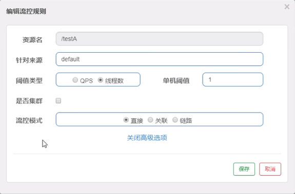

# QPS

**直接 -> 快速失败（系统默认）**

**配置及说明**

表示1秒钟内查询1次就是OK，若超过次数1，就直接->快速失败，报默认错误

测试

快速多次点击访问http://localhost:8401/testA

结果

返回页面 Blocked by Sentinel (flow limiting)

源码

com.alibaba.csp.sentinel.slots.block.flow.controller.DefaultController

思考

直接调用默认报错信息，技术方面OK，但是，是否应该有我们自己的后续处理？类似有个fallback的兜底方法?

# 线程数

线程数：当调用该API的线程数达到阈值的时候，进行限流。

