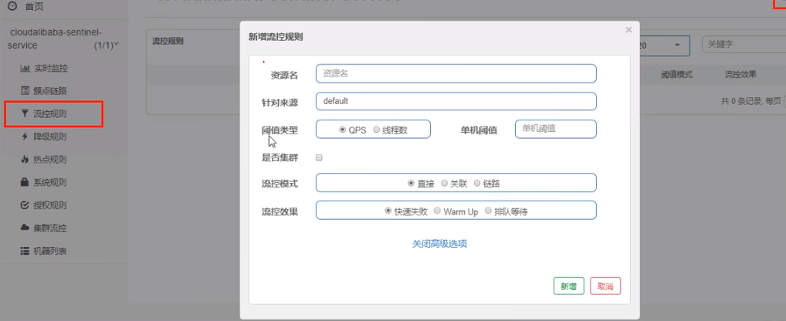

基本介绍

进一步解释说明：

* 资源名：唯一名称，默认请求路径。
* 针对来源：Sentinel可以针对调用者进行限流，填写微服务名，默认default（不区分来源）。
* 阈值类型/单机阈值：
  * QPS(每秒钟的请求数量)︰当调用该API的QPS达到阈值的时候，进行限流。
  * 线程数：当调用该API的线程数达到阈值的时候，进行限流。

* 是否集群：不需要集群。
* 流控模式：
  * 直接：API达到限流条件时，直接限流。
  * 关联：当关联的资源达到阈值时，就限流自己。
  * 链路：只记录指定链路上的流量（指定资源从入口资源进来的流量，如果达到阈值，就进行限流)【API级别的针对来源】。

* 流控效果：
  * 快速失败：直接失败，抛异常。
  * Warm up：根据Code Factor（冷加载因子，默认3）的值，从阈值/codeFactor，经过预热时长，才达到设置的QPS阈值。
  * 排队等待：匀速排队，让请求以匀速的速度通过，阈值类型必须设置为QPS，否则无效。
    