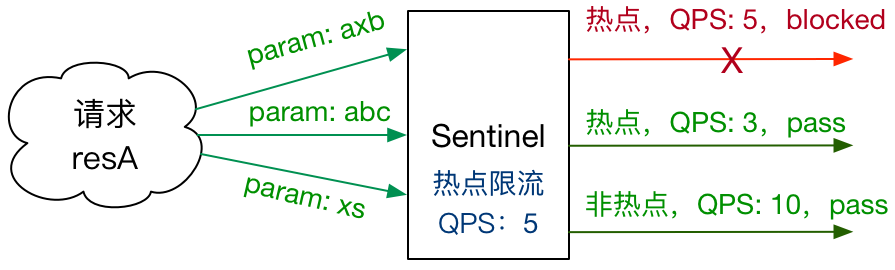
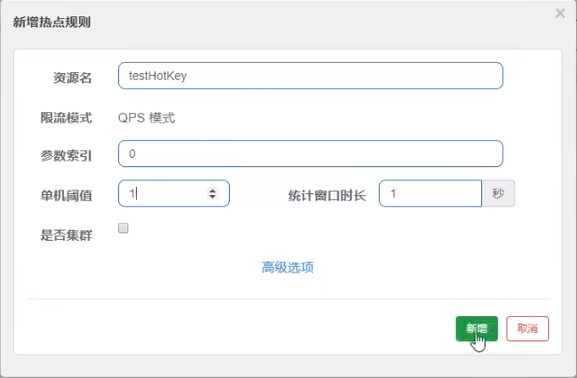
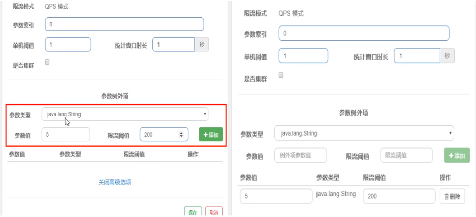

## Sentinel热点key

**基本介绍**


**官网**

[官方文档](https://github.com/alibaba/Sentinel/wiki/热点参数限流)

> 何为热点？热点即经常访问的数据。很多时候我们希望统计某个热点数据中访问频次最高的 Top K 数据，并对其访问进行限制。比如：
>
> 商品 ID 为参数，统计一段时间内最常购买的商品 ID 并进行限制
> 用户 ID 为参数，针对一段时间内频繁访问的用户 ID 进行限制
> 热点参数限流会统计传入参数中的热点参数，并根据配置的限流阈值与模式，对包含热点参数的资源调用进行限流。热点参数限流可以看做是一种特殊的流量控制，仅对包含热点参数的资源调用生效。
>
> 
>
> Sentinel 利用 LRU 策略统计最近最常访问的热点参数，结合令牌桶算法来进行参数级别的流控。热点参数限流支持集群模式。
>
> [link](https://github.com/alibaba/Sentinel/wiki/热点参数限流#overview)

承上启下复习start

兜底方法，分为系统默认和客户自定义，两种

之前的case，限流出问题后，都是用sentinel系统默认的提示: Blocked by Sentinel (flow limiting)

我们能不能自定？类似hystrix，某个方法出问题了，就找对应的兜底降级方法?

结论 - 从HystrixCommand到@SentinelResource

代码

com.alibaba.csp.sentinel.slots.block.BlockException
```java
@RestController
@Slf4j
public class FlowLimitController
{

    ...

    @GetMapping("/testHotKey")
    @SentinelResource(value = "testHotKey",blockHandler/*兜底方法*/ = "deal_testHotKey")
    public String testHotKey(@RequestParam(value = "p1",required = false) String p1,
                             @RequestParam(value = "p2",required = false) String p2) {
        //int age = 10/0;
        return "------testHotKey";
    }
    
    /*兜底方法*/
    public String deal_testHotKey (String p1, String p2, BlockException exception) {
        return "------deal_testHotKey,o(╥﹏╥)o";  //sentinel系统默认的提示：Blocked by Sentinel (flow limiting)
    }

}
```

**配置**



一

* @SentinelResource(value = "testHotKey")
* 异常打到了前台用户界面看到，不友好

二

* @SentinelResource(value = "testHotKey", blockHandler = "dealHandler_testHotKey")
* 方法testHotKey里面第一个参数只要QPS超过每秒1次，马上降级处理
* 异常用了我们自己定义的兜底方法

测试

* error
  * http://localhost:8401/testHotKey?p1=abc
  * http://localhost:8401/testHotKey?p1=abc&p2=33
* right
  * http://localhost:8401/testHotKey?p2=abc


# 参数例外项

上述案例演示了第一个参数p1，当QPS超过1秒1次点击后马上被限流。

**参数例外项**

- 普通 - 超过1秒钟一个后，达到阈值1后马上被限流
- **我们期望p1参数当它是某个特殊值时，它的限流值和平时不一样**
- 特例 - 假如当p1的值等于5时，它的阈值可以达到200

配置



测试

* right - http://localhost:8401/testHotKey?p1=5
* error - http://localhost:8401/testHotKey?p1=3
* 当p1等于5的时候，阈值变为200
* 当p1不等于5的时候，阈值就是平常的1

前提条件 - 热点参数的注意点，参数必须是基本类型或者String

其它

在方法体抛异常

```java
@RestController
@Slf4j
public class FlowLimitController
{

    ...

    @GetMapping("/testHotKey")
    @SentinelResource(value = "testHotKey",blockHandler/*兜底方法*/ = "deal_testHotKey")
    public String testHotKey(@RequestParam(value = "p1",required = false) String p1,
                             @RequestParam(value = "p2",required = false) String p2) {
        int age = 10/0;//<----------------------------会抛异常的地方
        return "------testHotKey";
    }
    
    /*兜底方法*/
    public String deal_testHotKey (String p1, String p2, BlockException exception) {
        return "------deal_testHotKey,o(╥﹏╥)o";  //sentinel系统默认的提示：Blocked by Sentinel (flow limiting)
    }

}
```

将会抛出Spring Boot 2的默认异常页面，而不是兜底方法。

* @SentinelResource - 处理的是sentinel控制台配置的违规情况，有blockHandler方法配置的兜底处理;
* RuntimeException int age = 10/0，这个是java运行时报出的运行时异常RunTimeException，@SentinelResource不管

总结 - @SentinelResource主管配置出错，运行出错该走异常走异常


