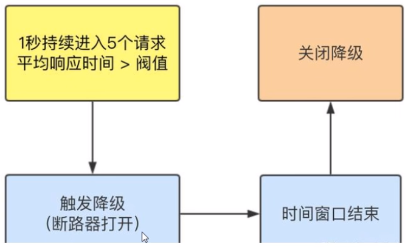
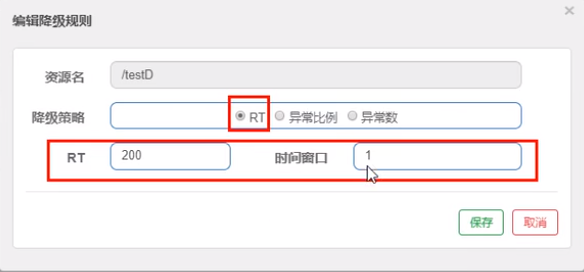
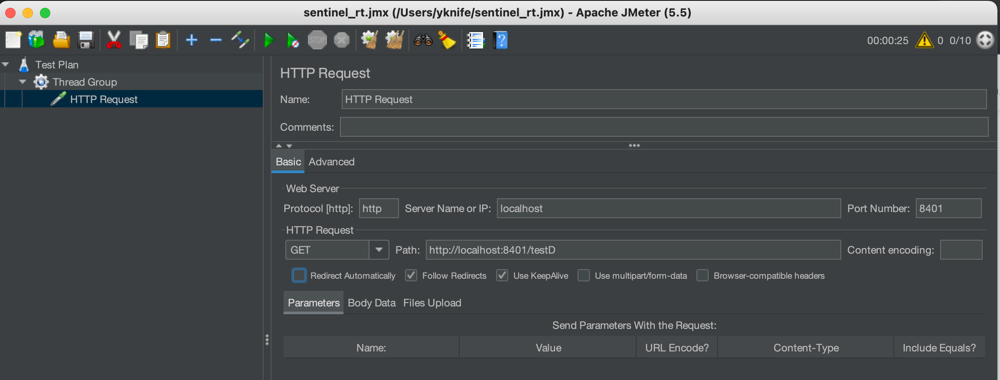

## Sentinel降级-RT

是什么？

> 平均响应时间(DEGRADE_GRADE_RT)：当1s内持续进入5个请求，对应时刻的平均响应时间（秒级）均超过阈值（ count，以ms为单位），那么在接下的时间窗口（DegradeRule中的timeWindow，以s为单位）之内，对这个方法的调用都会自动地熔断(抛出DegradeException )。注意Sentinel 默认统计的RT上限是4900 ms，超出此阈值的都会算作4900ms，若需要变更此上限可以通过启动配置项-Dcsp.sentinel.statistic.max.rt=xxx来配置。


**注意**：Sentinel 1.7.0才有**平均响应时间**（`DEGRADE_GRADE_RT`），Sentinel 1.8.0的没有这项，取而代之的是**慢调用比例** (`SLOW_REQUEST_RATIO`)。

> 慢调用比例 (SLOW_REQUEST_RATIO)：选择以慢调用比例作为阈值，需要设置允许的慢调用 RT（即最大的响应时间），请求的响应时间大于该值则统计为慢调用。当单位统计时长（statIntervalMs）内请求数目大于设置的最小请求数目，并且慢调用的比例大于阈值，则接下来的熔断时长内请求会自动被熔断。经过熔断时长后熔断器会进入探测恢复状态（HALF-OPEN 状态），若接下来的一个请求响应时间小于设置的慢调用 RT 则结束熔断，若大于设置的慢调用 RT 则会再次被熔断。[link](https://github.com/alibaba/Sentinel/wiki/熔断降级#熔断策略)

接下来讲解Sentinel 1.7.0的。



**测试**

代码

```java
@RestController
@Slf4j
public class FlowLimitController {
	...

    @GetMapping("/testD")
    public String testD() {
        try { 
            TimeUnit.SECONDS.sleep(1); 
        } catch (InterruptedException e) { 
            e.printStackTrace(); 
        }
        log.info("testD 测试RT");
    }
}
```

配置



jmeter压测



结论

按照上述配置，永远一秒钟打进来10个线程（大于5个了）调用testD，我们希望200毫秒处理完本次任务，如果超过200毫秒还没处理完，在未来1秒钟的时间窗口内，断路器打开（保险丝跳闸）微服务不可用，保险丝跳闸断电了后续我停止jmeter，没有这么大的访问量了，断路器关闭（保险丝恢复），微服务恢复OK。
