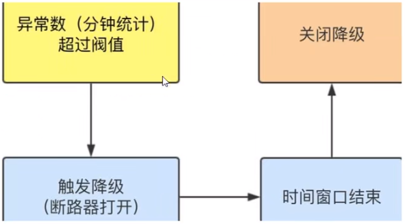
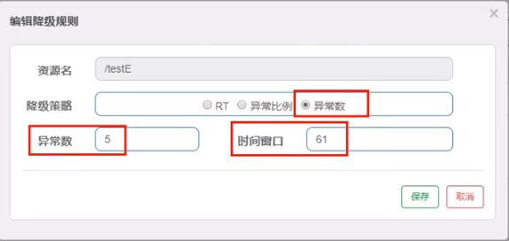

## Sentinel降级-异常数

是什么？

> 异常数( DEGRADE_GRADF_EXCEPTION_COUNT )：当资源近1分钟的异常数目超过阈值之后会进行熔断。注意由于统计时间窗口是分钟级别的，若timeWindow小于60s，则结束熔断状态后码可能再进入熔断状态。

注意，与Sentinel 1.8.0相比，有些不同（Sentinel 1.8.0才有的半开状态），Sentinel 1.8.0的如下：

> 异常数 (ERROR_COUNT)：当单位统计时长内的异常数目超过阈值之后会自动进行熔断。经过熔断时长后熔断器会进入探测恢复状态（HALF-OPEN 状态），若接下来的一个请求成功完成（没有错误）则结束熔断，否则会再次被熔断。

接下来讲解Sentinel 1.7.0的。

异常数是按照分钟统计的，时间窗口一定要大于等于60秒。



**测试**

代码

```java
@RestController
@Slf4j
public class FlowLimitController{
	...

    @GetMapping("/testE")
    public String testE()
    {
        log.info("testE 测试异常数");
        int age = 10/0;
        return "------testE 测试异常数";
    }
}

```

配置



访问http://localhost:8401/testE，第一次访问绝对报错，因为除数不能为零，我们看到error窗口，但是达到5次报错后，进入熔断后降级。