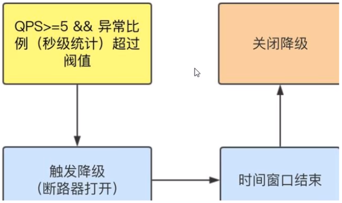
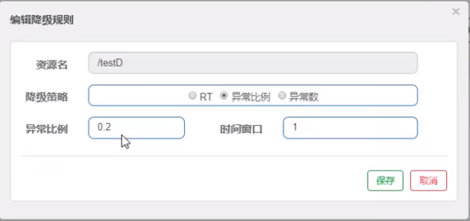
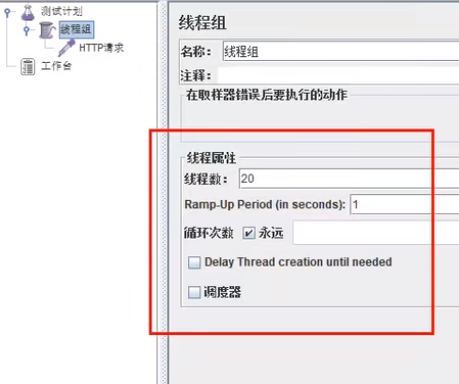

## Sentinel降级-异常比例

是什么？

> 异常比例(DEGRADE_GRADE_EXCEPTION_RATIO)：当资源的每秒请求量 >= 5，并且每秒异常总数占通过量的比值超过阈值（ DegradeRule中的 count）之后，资源进入降级状态，即在接下的时间窗口( DegradeRule中的timeWindow，以s为单位）之内，对这个方法的调用都会自动地返回。异常比率的阈值范围是[0.0, 1.0]，代表0% -100%。

注意，与Sentinel 1.8.0相比，有些不同（Sentinel 1.8.0才有的半开状态），Sentinel 1.8.0的如下：

> 异常比例 (ERROR_RATIO)：当单位统计时长（statIntervalMs）内请求数目大于设置的最小请求数目，并且异常的比例大于阈值，则接下来的熔断时长内请求会自动被熔断。经过熔断时长后熔断器会进入探测恢复状态（HALF-OPEN 状态），若接下来的一个请求成功完成（没有错误）则结束熔断，否则会再次被熔断。异常比率的阈值范围是 [0.0, 1.0]，代表 0% - 100%。[link](https://github.com/alibaba/Sentinel/wiki/熔断降级#熔断策略)

接下来讲解Sentinel 1.7.0的。



**测试**

代码

```java
@RestController
@Slf4j
public class FlowLimitController {

    ...

    @GetMapping("/testD")
    public String testD() {
        log.info("testD 异常比例");
        int age = 10/0;
        return "------testD";
    }
}
```

配置



jmeter



*结论*

按照上述配置，单独访问一次，必然来一次报错一次(int age = 10/0)，调一次错一次。

开启jmeter后，直接高并发发送请求，多次调用达到我们的配置条件了。断路器开启(保险丝跳闸)，微服务不可用了，不再报错error而是服务降级了。