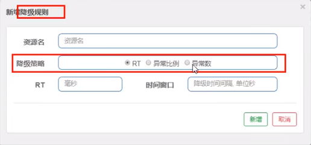

## Sentinel降级简介

[官方文档](https://github.com/alibaba/Sentinel/wiki/熔断降级)

> 熔断降级概述
>
> 除了流量控制以外，对调用链路中不稳定的资源进行熔断降级也是保障高可用的重要措施之一。一个服务常常会调用别的模块，可能是另外的一个远程服务、数据库，或者第三方 API 等。例如，支付的时候，可能需要远程调用银联提供的 API；查询某个商品的价格，可能需要进行数据库查询。然而，这个被依赖服务的稳定性是不能保证的。如果依赖的服务出现了不稳定的情况，请求的响应时间变长，那么调用服务的方法的响应时间也会变长，线程会产生堆积，最终可能耗尽业务自身的线程池，服务本身也变得不可用。
>
> 现代微服务架构都是分布式的，由非常多的服务组成。不同服务之间相互调用，组成复杂的调用链路。以上的问题在链路调用中会产生放大的效果。复杂链路上的某一环不稳定，就可能会层层级联，最终导致整个链路都不可用。因此我们需要对不稳定的弱依赖服务调用进行熔断降级，暂时切断不稳定调用，避免局部不稳定因素导致整体的雪崩。熔断降级作为保护自身的手段，通常在客户端（调用端）进行配置。
>
> [link](https://github.com/alibaba/Sentinel/wiki/熔断降级#概述)

* RT（平均响应时间，秒级）
  * 平均响应时间 超出阈值 且 在时间窗口内通过的请求>=5，两个条件同时满足后触发降级。
  * 窗口期过后关闭断路器。
  * RT最大4900（更大的需要通过-Dcsp.sentinel.statistic.max.rt=XXXX才能生效）。

* 异常比列（秒级）
  * QPS >= 5且异常比例（秒级统计）超过阈值时，触发降级;时间窗口结束后，关闭降级 。

* 异常数(分钟级)
  * 异常数(分钟统计）超过阈值时，触发降级;时间窗口结束后，关闭降级

Sentinel熔断降级会在调用链路中某个资源出现不稳定状态时（例如调用超时或异常比例升高)，对这个资源的调用进行限制，让请求快速失败，避免影响到其它的资源而导致级联错误。

当资源被降级后，在接下来的降级时间窗口之内，对该资源的调用都自动熔断（默认行为是抛出 DegradeException）。

Sentinei的断路器是没有类似Hystrix半开状态的。(Sentinei 1.8.0 已有半开状态)

半开的状态系统自动去检测是否请求有异常，没有异常就关闭断路器恢复使用，有异常则继续打开断路器不可用。

具体可以参考49_Hystrix的服务降级熔断限流概念初讲。
