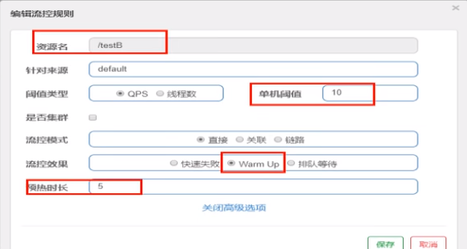

> Warm Up
>
> Warm Up（RuleConstant.CONTROL_BEHAVIOR_WARM_UP）方式，即预热/冷启动方式。当系统长期处于低水位的情况下，当流量突然增加时，直接把系统拉升到高水位可能瞬间把系统压垮。通过"冷启动"，让通过的流量缓慢增加，在一定时间内逐渐增加到阈值上限，给冷系统一个预热的时间，避免冷系统被压垮。详细文档可以参考 [流量控制 - Warm Up 文档](https://github.com/alibaba/Sentinel/wiki/限流---冷启动)，具体的例子可以参见 [WarmUpFlowDemo](https://github.com/alibaba/Sentinel/blob/master/sentinel-demo/sentinel-demo-basic/src/main/java/com/alibaba/csp/sentinel/demo/flow/WarmUpFlowDemo.java)。
> 通常冷启动的过程系统允许通过的 QPS 曲线如下图所示：
>
> 
>
> [link](https://github.com/alibaba/Sentinel/wiki/流量控制#warm-up)

> 默认coldFactor为3，即请求QPS 从 threshold / 3开始，经预热时长逐渐升至设定的QPS阈值。[link](https://github.com/alibaba/Sentinel/wiki/流量控制#warm-up)

源码 - com.alibaba.csp.sentinel.slots.block.flow.controller.WarmUpController

WarmUp配置

案例，阀值为10+预热时长设置5秒。

系统初始化的阀值为10/ 3约等于3,即阀值刚开始为3;然后过了5秒后阀值才慢慢升高恢复到10

**测试**

多次快速点击http://localhost:8401/testB - 刚开始不行，后续慢慢OK

**应用场景**

如：秒杀系统在开启的瞬间，会有很多流量上来，很有可能把系统打死，预热方式就是把为了保护系统，可慢慢的把流量放进来,慢慢的把阀值增长到设置的阀值。

