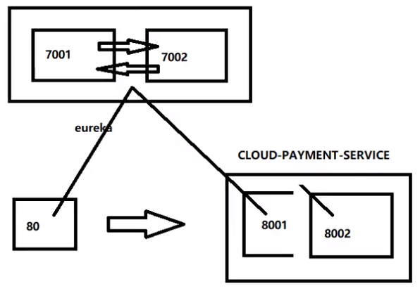

1. 参考cloud-provicer-payment8001，新建cloud-provider-payment8002

2. 修改8001/8002的Controller，添加serverPort

   ```java
   @RestController
   @Slf4j
   public class PaymentController{
   
       @Value("${server.port}")
       private String serverPort;//添加serverPort
   
       @PostMapping(value = "/payment/create")
       public CommonResult create(@RequestBody Payment payment)
       {
           int result = paymentService.create(payment);
           log.info("*****插入结果：" + result);
   
           if(result > 0) {
               return new CommonResult(200,"插入数据库成功,serverPort: "+serverPort/*添加到此处*/, result);
           }else{
               return new CommonResult(444,"插入数据库失败",null);
           }
       }
   }
   ```

3. **负载均衡**

   ```java
   @Slf4j
   @RestController
   public class OrderController {
   
       //public static final String PAYMENT_URL = "http://localhost:8001";
       public static final String PAYMENT_URL = "http://CLOUD-PAYMENT-SERVICE";
       
       ...
   }
   ```

4. 使用@LoadBalanced注解赋予RestTemplate负载均衡的能力

   ```java
   @Configuration
   public class ApplicationContextConfig {
   
       @Bean
       @LoadBalanced//使用@LoadBalanced注解赋予RestTemplate负载均衡的能力
       public RestTemplate getRestTemplate(){
           return new RestTemplate();
       }
   }
   ```

5. 测试

   ApplicationContextBean - 提前说一下Ribbon的负载均衡功能

   测试

   先要启动EurekaServer，7001/7002服务

   再要启动服务提供者provider，8001/8002服务

   浏览器输入 - http://localhost/consumer/payment/get/31

   结果：负载均衡效果达到，8001/8002端口交替出现

   Ribbon和Eureka整合后Consumer可以直接调用服务而不用再关心地址和端口号，且该服务还有负载功能。

   相互注册，相互守望


   

   

   