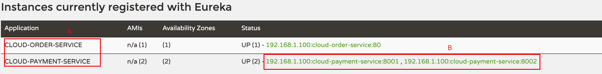

```java
@RestController
@Slf4j
public class PaymentController{
	...
    
    @Resource
    private DiscoveryClient discoveryClient;//选spring中的DiscoveryClient

    ...

    @GetMapping(value = "/payment/discovery")
    public Object discovery()
    {
        List<String> services = discoveryClient.getServices();
        for (String element : services) {
            log.info("*****element: "+element);//图中A部分数据
        }

        List<ServiceInstance> instances = discoveryClient.getInstances("CLOUD-PAYMENT-SERVICE");
        for (ServiceInstance instance : instances) {          log.info(instance.getServiceId()+"\t"+instance.getHost()+"\t"+instance.getPort()+"\t"+instance.getUri());//图中B部分数据
        }

        return this.discoveryClient;
    }
}
```

