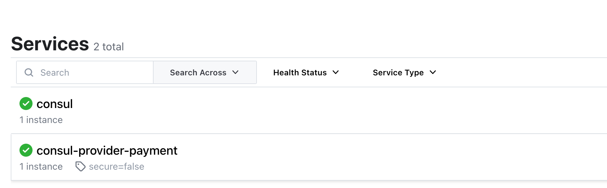

1. 新建cloud-provider-consul-payment8006

2. 引入依赖

   ```xml
   <?xml version="1.0" encoding="UTF-8"?>
   <project xmlns="http://maven.apache.org/POM/4.0.0"
            xmlns:xsi="http://www.w3.org/2001/XMLSchema-instance"
            xsi:schemaLocation="http://maven.apache.org/POM/4.0.0 http://maven.apache.org/xsd/maven-4.0.0.xsd">
       <parent>
           <artifactId>cloud2022</artifactId>
           <groupId>org.example</groupId>
           <version>1.0-SNAPSHOT</version>
       </parent>
       <modelVersion>4.0.0</modelVersion>
   
       <artifactId>cloud-provider-consul-payment8006</artifactId>
   
       <dependencies>
           <!-- 引入自己定义的api通用包，可以使用Payment支付Entity -->
           <dependency>
               <groupId>org.example</groupId>
               <artifactId>cloud-api-commons</artifactId>
               <version>1.0-SNAPSHOT</version>
           </dependency>
           <!--SpringCloud consul-server -->
           <dependency>
               <groupId>org.springframework.cloud</groupId>
               <artifactId>spring-cloud-starter-consul-discovery</artifactId>
           </dependency>
           <!-- SpringBoot整合Web组件 -->
           <dependency>
               <groupId>org.springframework.boot</groupId>
               <artifactId>spring-boot-starter-web</artifactId>
           </dependency>
           <dependency>
               <groupId>org.springframework.boot</groupId>
               <artifactId>spring-boot-starter-actuator</artifactId>
           </dependency>
           <!--日常通用jar包配置-->
           <dependency>
               <groupId>org.springframework.boot</groupId>
               <artifactId>spring-boot-devtools</artifactId>
               <scope>runtime</scope>
               <optional>true</optional>
           </dependency>
           <dependency>
               <groupId>org.projectlombok</groupId>
               <artifactId>lombok</artifactId>
               <optional>true</optional>
           </dependency>
           <dependency>
               <groupId>org.springframework.boot</groupId>
               <artifactId>spring-boot-starter-test</artifactId>
               <scope>test</scope>
           </dependency>
           <dependency>
               <groupId>cn.hutool</groupId>
               <artifactId>hutool-all</artifactId>
               <version>RELEASE</version>
               <scope>test</scope>
           </dependency>
       </dependencies>
   </project>
   ```

3. 添加yaml

   ```yaml
   ###consul服务端口号
   server:
     port: 8006
   
   spring:
     application:
       name: consul-provider-payment
     ####consul注册中心地址
     cloud:
       consul:
         host: localhost
         port: 8500
         discovery:
           #hostname: 127.0.0.1
           service-name: ${spring.application.name}
   ```

4. 添加主启动类

   ```java
   @SpringBootApplication
   @EnableDiscoveryClient
   public class PaymentMain8006
   {
       public static void main(String[] args) {
           SpringApplication.run(PaymentMain8006.class, args);
       }
   }
   ```

5. 添加控制类

   ```java
   @RestController
   @Slf4j
   public class PaymentController
   {
       @Value("${server.port}")
       private String serverPort;
   
       @RequestMapping(value = "/payment/consul")
       public String paymentConsul()
       {
           return "springcloud with consul: "+serverPort+"\t   "+ UUID.randomUUID().toString();
       }
   }
   ```

6. 启动consul

7. 启动支付服务

   