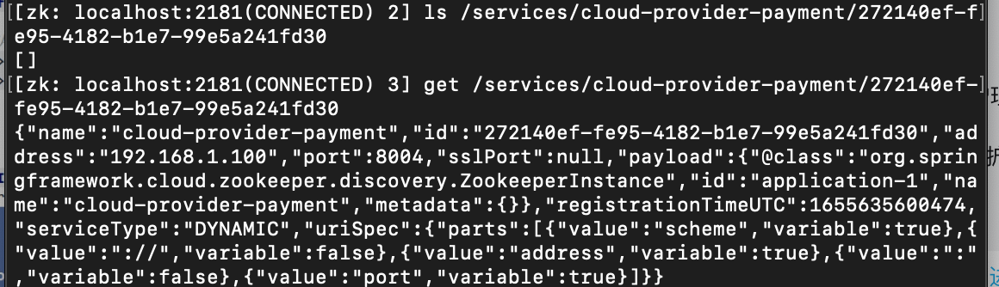

1. 添加pom

   ```xml
   <?xml version="1.0" encoding="UTF-8"?>
   <project xmlns="http://maven.apache.org/POM/4.0.0"
            xmlns:xsi="http://www.w3.org/2001/XMLSchema-instance"
            xsi:schemaLocation="http://maven.apache.org/POM/4.0.0 http://maven.apache.org/xsd/maven-4.0.0.xsd">
       <parent>
           <artifactId>cloud2022</artifactId>
           <groupId>org.example</groupId>
           <version>1.0-SNAPSHOT</version>
       </parent>
       <modelVersion>4.0.0</modelVersion>
   
       <artifactId>cloud-provider-payment8004</artifactId>
   
       <dependencies>
           <!-- SpringBoot整合Web组件 -->
           <dependency>
               <groupId>org.springframework.boot</groupId>
               <artifactId>spring-boot-starter-web</artifactId>
           </dependency>
           <dependency><!-- 引入自己定义的api通用包，可以使用Payment支付Entity -->
               <groupId>org.example</groupId>
               <artifactId>cloud-api-commons</artifactId>
               <version>${project.version}</version>
           </dependency>
           <!-- SpringBoot整合zookeeper客户端 -->
           <dependency>
               <groupId>org.springframework.cloud</groupId>
               <artifactId>spring-cloud-starter-zookeeper-discovery</artifactId>
               <!--先排除自带的zookeeper3.5.3 防止与3.4.9起冲突-->
               <exclusions>
                   <exclusion>
                       <groupId>org.apache.zookeeper</groupId>
                       <artifactId>zookeeper</artifactId>
                   </exclusion>
               </exclusions>
           </dependency>
           <!--添加zookeeper3.4.9版本，不一定要与zookeeper版本对应（我使用的版本zk3.7.0）-->
           <dependency>
               <groupId>org.apache.zookeeper</groupId>
               <artifactId>zookeeper</artifactId>
               <version>3.4.9</version>
           </dependency>
           <dependency>
               <groupId>org.springframework.boot</groupId>
               <artifactId>spring-boot-devtools</artifactId>
               <scope>runtime</scope>
               <optional>true</optional>
           </dependency>
           <dependency>
               <groupId>org.projectlombok</groupId>
               <artifactId>lombok</artifactId>
               <optional>true</optional>
           </dependency>
           <dependency>
               <groupId>org.springframework.boot</groupId>
               <artifactId>spring-boot-starter-test</artifactId>
               <scope>test</scope>
           </dependency>
       </dependencies>
   </project>
   ```

2. 添加yaml

   ```yaml
   #8004表示注册到zookeeper服务器的支付服务提供者端口号
   server:
     port: 8004
   
   #服务别名----注册zookeeper到注册中心名称
   spring:
     application:
       name: cloud-provider-payment
     cloud:
       zookeeper:
         connect-string: 127.0.0.1:2181 # 192.168.111.144:2181 #
   ```

3. 启动类

   ```java
   @SpringBootApplication
   @EnableDiscoveryClient//该注解用于向使用consul或者zookeeper作为注册中心时注册服务
   public class PaymentMain8004 {
       public static void main(String[] args) {
           SpringApplication.run(PaymentMain8004.class, args);
       }
   }
   ```

4. 控制层

   ```java
   @RestController
   @Slf4j
   public class PaymentController {
       @Value("${server.port}")
       private String serverPort;
   
       @RequestMapping(value = "/payment/zk")
       public String paymentzk()
       {
           return "springcloud with zookeeper: "+serverPort+"\t"+ UUID.randomUUID().toString();
       }
   }
   ```

5. 启动zkServer

6. 启动支付模块可以正常注册到zk上

7. zk中的services节点

   

8. ZooKeeper的服务节点是**临时节点**，没有Eureka那含情脉脉。


