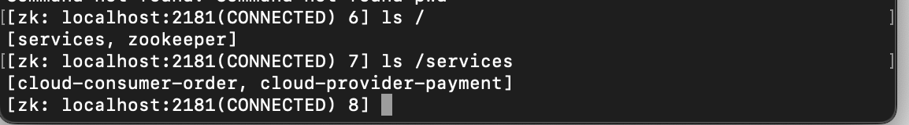

1. 新建cloud-consumerzk-order80

2. 引入依赖

   ```xml
   <?xml version="1.0" encoding="UTF-8"?>
   <project xmlns="http://maven.apache.org/POM/4.0.0"
            xmlns:xsi="http://www.w3.org/2001/XMLSchema-instance"
            xsi:schemaLocation="http://maven.apache.org/POM/4.0.0 http://maven.apache.org/xsd/maven-4.0.0.xsd">
       <parent>
           <artifactId>cloud2022</artifactId>
           <groupId>org.example</groupId>
           <version>1.0-SNAPSHOT</version>
       </parent>
       <modelVersion>4.0.0</modelVersion>
   
       <artifactId>cloud-consumerzk-order80</artifactId>
   
       <dependencies>
           <!-- SpringBoot整合Web组件 -->
           <dependency>
               <groupId>org.springframework.boot</groupId>
               <artifactId>spring-boot-starter-web</artifactId>
           </dependency>
           <!-- SpringBoot整合zookeeper客户端 -->
           <dependency>
               <groupId>org.springframework.cloud</groupId>
               <artifactId>spring-cloud-starter-zookeeper-discovery</artifactId>
               <!--先排除自带的zookeeper-->
               <exclusions>
                   <exclusion>
                       <groupId>org.apache.zookeeper</groupId>
                       <artifactId>zookeeper</artifactId>
                   </exclusion>
               </exclusions>
           </dependency>
           <!--添加zookeeper3.4.9版本-->
           <dependency>
               <groupId>org.apache.zookeeper</groupId>
               <artifactId>zookeeper</artifactId>
               <version>3.4.9</version>
           </dependency>
           <dependency>
               <groupId>org.springframework.boot</groupId>
               <artifactId>spring-boot-devtools</artifactId>
               <scope>runtime</scope>
               <optional>true</optional>
           </dependency>
           <dependency>
               <groupId>org.projectlombok</groupId>
               <artifactId>lombok</artifactId>
               <optional>true</optional>
           </dependency>
           <dependency>
               <groupId>org.springframework.boot</groupId>
               <artifactId>spring-boot-starter-test</artifactId>
               <scope>test</scope>
           </dependency>
       </dependencies>
   
   </project>
   ```

3. 添加yaml

   ```yaml
   server:
     port: 80
   
   #服务别名----注册zookeeper到注册中心名称
   spring:
     application:
       name: cloud-consumer-order
     cloud:
       zookeeper:
         connect-string: 127.0.0.1:2181 # 192.168.111.144:2181 #
   ```

4. 添加负载均衡配置

   ```java
   @Configuration
   public class ApplicationContextConfig
   {
       @Bean
       @LoadBalanced
       public RestTemplate getRestTemplate()
       {
           return new RestTemplate();
       }
   }
   ```

5. 添加控制类

   ```java
   @RestController
   @Slf4j
   public class OrderZKController
   {
       public static final String INVOKE_URL = "http://cloud-provider-payment";
   
       @Resource
       private RestTemplate restTemplate;
   
       @GetMapping(value = "/consumer/payment/zk")
       public String paymentInfo()
       {
           String result = restTemplate.getForObject(INVOKE_URL+"/payment/zk",String.class);
           return result;
       }
   }
   ```

6. 添加启动类

   ```java
   @SpringBootApplication
   @EnableDiscoveryClient
   public class OrderZKMain80 {
       public static void main(String[] args) {
           SpringApplication.run(OrderZKMain80.class, args);
       }
   }
   ```

7. 启动服务后zk中服务包含2个，订单和支付

   

8. 可以通过订单服务负载均衡访问到支付服务

   http://localhost/consumer/payment/zk

