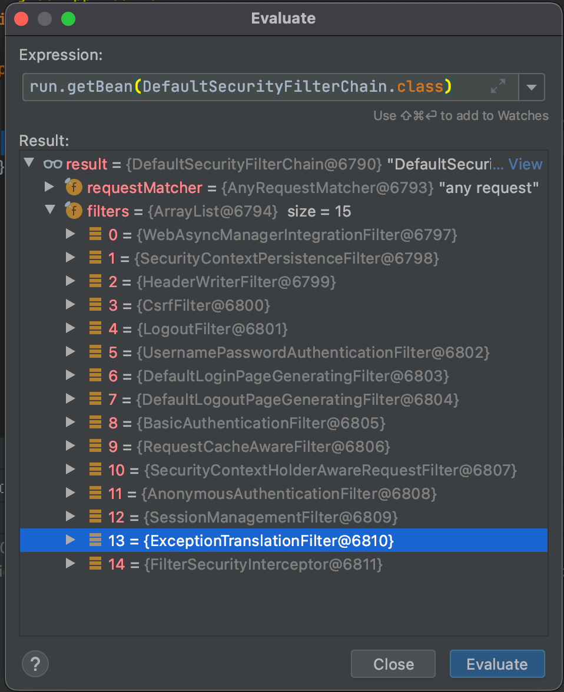

**SpringSecurity完整流程**

SpringSecurity的原理其实就是一个过滤器链，内部包含了提供各种功能的过滤器。这里我们可以看看入门案例中的过滤器。

​	图中只展示了核心过滤器，其它的非核心过滤器并没有在图中展示。

**UsernamePasswordAuthenticationFilter**:负责处理我们在登陆页面填写了用户名密码后的登陆请求。入门案例的认证工作主要有它负责。

**ExceptionTranslationFilter：**处理过滤器链中抛出的任何AccessDeniedException和AuthenticationException 。

**FilterSecurityInterceptor：**负责权限校验的过滤器。

​	我们可以通过Debug查看当前系统中SpringSecurity过滤器链中有哪些过滤器及它们的顺序。

