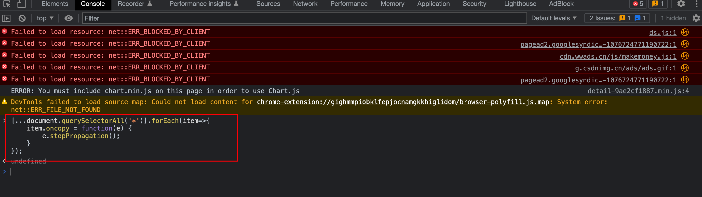

某些网站我们不能进行文字的复制或是复制文字之后带版权信息等小尾巴，影响我们的工作效率，怎样解决这个问题呢？小白福利来啦！下面手把手教你去除小尾巴。

```js
[...document.querySelectorAll('*')].forEach(item=>{
    item.oncopy = function(e) {
        e.stopPropagation();
    }
});
```

使用方法：将以上代码粘贴到浏览器控制台（谷歌浏览器按F12，Console选项即控制台；火狐浏览器按F12，选择“控制台”），回车执行。

原理：阻止 oncopy事件冒泡到父元素，从而使js失效，达到能够正常复制文字/复制文字不带版权信息的目的。

