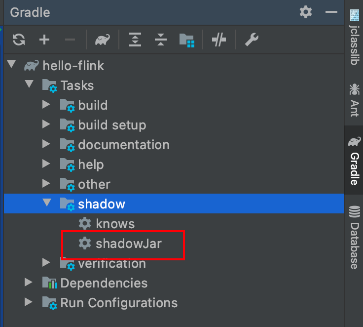
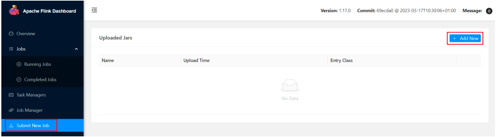
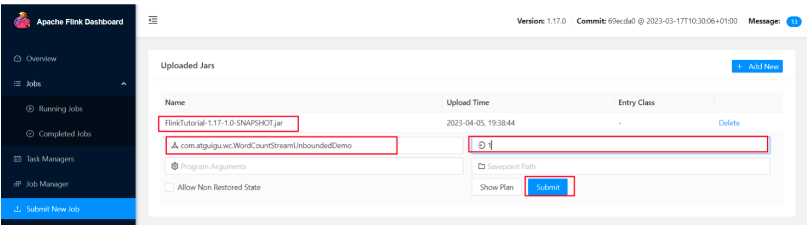
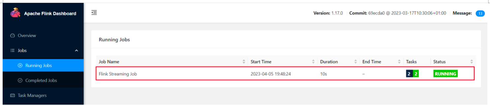
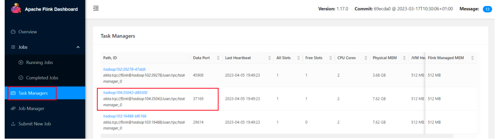
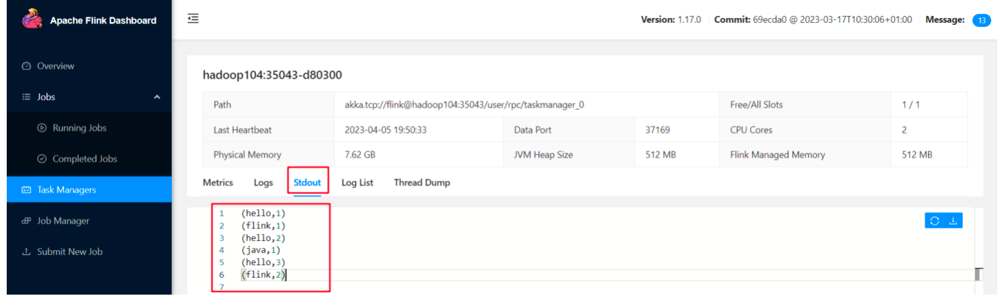
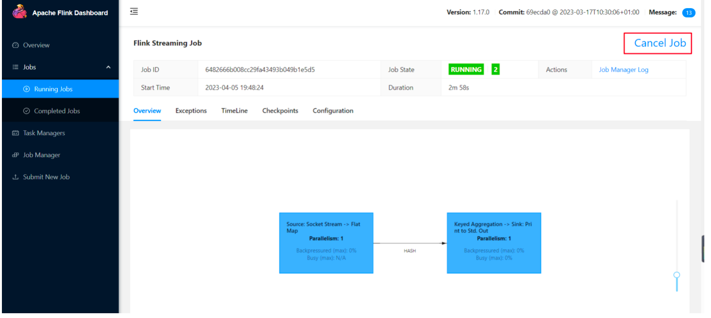

## 提交作业

1. 使用gradle打包

   ```groovy
   plugins {
       id 'java'
       id 'com.github.johnrengelman.shadow' version '6.1.0'
   }
   
   group 'org.example'
   version '1.0-SNAPSHOT'
   
   repositories {
       maven { url 'https://maven.aliyun.com/repository/public/' }
       mavenCentral()
   }
   
   dependencies {
     //需要使用compileOnly，才不会将依赖打入jar中
       compileOnly 'org.apache.flink:flink-streaming-java:1.17.0'
       compileOnly 'org.apache.flink:flink-clients:1.17.0'
       testCompile group: 'junit', name: 'junit', version: '4.12'
   }
   ```

   可用shadow插件直接打出无依赖的jar包

   

2. 任务打包完成后，我们打开Flink的WEB UI页面，在右侧导航栏点击“Submit New Job”，然后点击按钮“+ Add New”，选择要上传运行的JAR包，如下图所示。

   

3. 点击该JAR包，出现任务配置页面，进行相应配置。

   

   主要配置程序入口主类的全类名，任务运行的并行度，任务运行所需的配置参数和保存点路径等，如下图所示，配置完成后，即可点击按钮“Submit”，将任务提交到集群运行。

4. 任务提交成功之后，可点击左侧导航栏的“Running Jobs”查看程序运行列表情况。

   

5. 测试

   ```sh
   nc -lk 8888
   ```

6. 先点击Task Manager，然后点击右侧的192.168.10.104服务器节点

   

7. 点击Stdout，就可以看到hello单词的统计

   

8. 点击该任务，可以查看任务运行的具体情况，也可以通过点击“Cancel Job”结束任务运行。

   

9. 命令行提交任务

   ```sh
    bin/flink run -m flink01:8081 -c org.example.flink.StreamWordCount /u01/ysw/hello-flink-1.0-SNAPSHOT-all.jar 
   ```
   


​	


